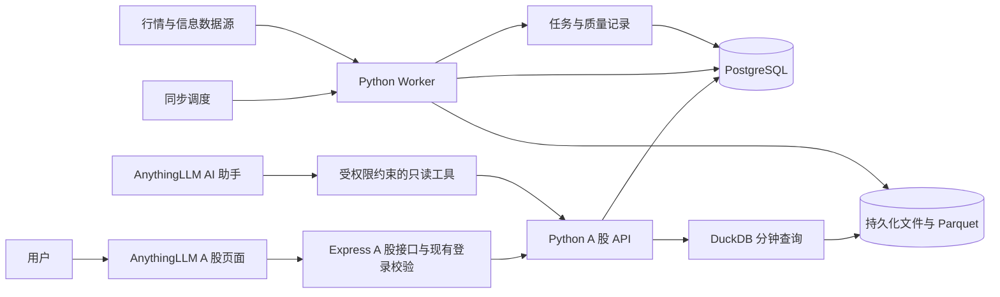
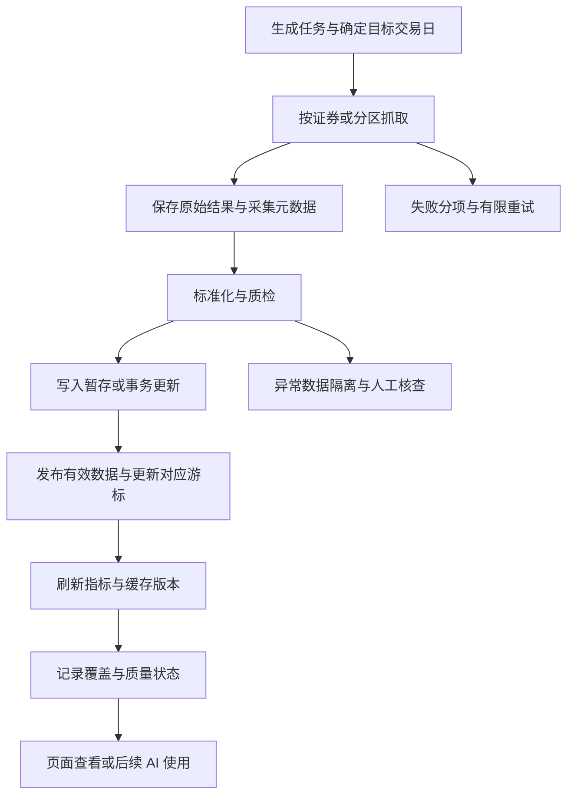

# AnythingLLM A 股业务域与数据整合方案

- 状态：讨论稿 v0.3；AnythingLLM 中已开始实现 A 股工作台首期能力，完整方案仍分阶段实施。
- 日期：2026-09-29。
- 依据：当前工作空间六个仓库的本地源码、配置和说明文档，以及 Fuyao 公开接口文档。
- 交付范围：本文仍作为技术与产品目标；已实现范围以
  [`anything-llm/ashare-service/README.md`](../anything-llm/ashare-service/README.md) 为准。

## 1. 目标与建议结论

在 AnythingLLM 内建立可独立使用的 A 股分析工作台，支持 K 线、行情与基本面查看、
自定义标签分类、自选股、分组和多股对比。先建立可信的数据存储、同步和查询能力，
再接入 AI 助手。

建议采用以下结构：

1. AnythingLLM 承担页面入口、现有登录机制和后续 Workspace AI 对话。
2. 在同一二开仓库增加 Python A 股服务，使用 FastAPI，独立进程提供查询、同步和分析。
3. PostgreSQL 保存日线、结构化资料、标签分类、自选分组和同步状态。
4. 文件存储保存原始采集结果、分钟线 Parquet 和分析输入快照；分钟线由 DuckDB 查询。
5. 页面和 AI 工具调用同一套业务查询逻辑，共享股票标识、复权规则与质量状态。

这套结构复用现有 Python 数据生态，也能沿用 AnythingLLM 的前端和身份体系。
首期部署只需要 AnythingLLM、A 股 API、同步 Worker、PostgreSQL 和持久化文件目录。

数据获取建议以 Fuyao 全市场未复权日线 Parquet 为主入口：首次获取近 10 年全量文件，
按配置导入近 5 年；日常获取最近 10 个交易日文件并幂等更新。
AKShare 补充沪深板块资料、历史日历和独立来源校验；BaoStock 等保留为补充候选。
Fuyao 正式作为主源前，需用有相应权限的 API Key 验证实际覆盖、发布时间和字段契约。

### 1.1 已确认的需求

- 首期以盘后分析为主，覆盖沪深主板、创业板和科创板，北交所不纳入范围。
- 本文“全市场”均指上述已确认范围内的 A 股，指数作为独立的可选比较基准。
- 股票支持自由编写的标签分类，用于后续页面筛选和构建分组。
- 业务界面集成在 AnythingLLM 内，并为后续 AI 助手准备统一数据接口。
- 当前按个人独立使用或业务数据全局共享设计；行情、标签、自选、分组和备注共用一套。
  A 股业务不按用户或 Workspace 分库存储、筛选与授权。

首期日线范围内还提供周/月聚合。分钟线与盘中报价保留为后续扩展。
页面功能、导航和交互细化见 [A 股前端功能设计](ashare-frontend-design.md)。

### 1.2 产品与部署约定

| 项目 | 草案暂定 | 对方案的影响 |
| --- | --- | --- |
| 使用规模 | 个人独立使用，或多人共用业务数据 | 单机部署，业务库使用全局共享模型 |
| 扩展证券类型 | 指数独立建模，可用作比较基准 | 具体指数和 ETF 范围待确定 |
| 历史深度 | 首期近 5 年日线，可扩展至上市日起 | 回填和存储容量随深度调整 |
| 数据预算 | 建议优先 Fuyao，公开源补充 | API Key 权限、费用及使用条件待核对 |
| 资产归属 | 行情、标签、自选和分组全局共享，已确认 | 编辑结果对全部使用者生效 |

## 2. 参考项目梳理

以下为本地代码和 Fuyao 公开文档的静态核对结果。
README 中的采集速度、覆盖深度和稳定性，以及外部接口的实际数据质量，均未在本次实测。

### 2.1 项目定位与复用方向

| 项目 | 当前定位 | 建议参考或提取的能力 |
| --- | --- | --- |
| `astock-data-toolkit` | 全市场历史、增量、分钟线及信息采集脚本 | 数据源适配、回填流程、断点与质检规则 |
| `Sequoia-X` | BaoStock 日线同步、SQLite、盘后策略筛选 | 策略接口、后复权使用经验、确定性选股逻辑 |
| `daily_stock_analysis` | 多源行情、分析报告、Agent、Web 工作台 | 多源降级、股票补全、导入、筛选与提醒流程 |
| `awesome-finai-tools-zn` | 金融工具与 MCP 资源目录 | 数据源及 AI 工具选型线索 |
| `akshare` | 多来源金融数据接口库 | 沪深名单、历史行情、复权依据、财务与接口元数据 |
| `anything-llm` | React 前端、Express 服务、Workspace、RAG 与 MCP | 主应用、认证、权限、导航与 AI 接入入口 |

`awesome-finai-tools-zn` 是资源清单，并非已经运行的数据同步服务。
清单中的第三方工具需要单独验证后才能列入正式依赖。

### 2.2 存储与口径差异

- toolkit 的个股日线通过 `adjust='qfq'` 获取前复权数据，主要写入 Parquet。
  公告、财务摘要与增减持写入 SQLite；分钟线先保存压缩 CSV，再构建 Parquet。
  其默认排除北交所，与已确认的市场范围一致。
  其说明将日线来源标为腾讯，但实际调用 `stock_zh_a_daily`；新增 AKShare 的该接口
  实现及说明均指向新浪。正式来源登记应核对锁定版本中的实际调用路径。
- Sequoia-X 通过 BaoStock `adjustflag='1'` 获取后复权日线，写入 SQLite。
  其中 `stock_daily.turnover` 实际保存成交额，不能直接映射为换手率。
- daily_stock_analysis 使用 SQLAlchemy 与 SQLite 保存行情、报告和业务状态，
  通过 `DataFetcherManager` 组织多数据源；复权和字段语义需要按适配器分别核对。
- daily_stock_analysis 的历史行情服务当前实际只实现日线；接口说明出现周线、月线，
  不能视为这两种聚合已经可复用。其自选股入口通过系统配置维护股票列表。
- AnythingLLM 当前 Prisma 主数据库为 SQLite，保存用户、Workspace、文档和会话。
  A 股业务数据由新增服务管理，并保持独立的数据生命周期。

### 2.3 复用方式与适配约束

1. 优先提取数据源适配与规则，统一入口后逐步替换脚本中的路径、调度和写库逻辑。
2. toolkit 的周更流程适合作为历史与低频信息任务参考，日行情需要增加日更机制。
3. Sequoia-X 的同步会按返回数据的日期删除已有行再插入；统一服务应采用按股票和日期
   幂等更新，防止部分抓取成功时影响同日其他股票的数据。
4. Sequoia-X 会过滤零成交记录；新服务需要显式表示停牌与缺失，保留原始记录用于核查。
5. 策略输入改为统一数据服务提供的 DataFrame；策略中的额外行情抓取也纳入适配器。
6. 保留提取代码的来源和授权信息。daily 的筛选子模块包含独立 Apache-2.0 LICENSE，
   提取时应按子模块实际声明处理。

参考源码入口见第 13 节。

### 2.4 新增 AKShare 源码的借鉴结论

本地 AKShare 基线为 `0191689`，版本 `1.18.97`，声明 Python `>=3.11`。
建议数据服务以 Python 3.12 为初始验证环境，锁定库版本后做接口准入验证。

可优先使用或借鉴的接口：

| 能力 | 具体接口 | 对当前方案的价值 |
| --- | --- | --- |
| 沪市名单 | `stock_info_sh_name_code` | 按主板 A 股或科创板获取名单和上市日期 |
| 深市名单 | `stock_info_sz_name_code` | A 股名单含板块、上市日期、股本与行业字段 |
| 东财日线 | `stock_zh_a_hist` | 原始/前复权/后复权、日期窗口及周期参数 |
| 腾讯日线 | `stock_zh_a_hist_tx` | 独立上游候选，含量额及换手率转换 |
| 新浪日线与因子 | `stock_zh_a_daily` | 日线、股本及 `qfq-factor/hfq-factor` 校验候选 |
| 财务三表 | `stock_financial_report_sina` | 输出包含报告日、公告日期、更新日期与币种 |
| 历史交易日历 | `tool_trade_date_hist_sina` | 为交易日判断提供候选依据 |
| 请求与分页 | `request_with_retry`、`fetch_paginated_data` | 超时、退避、抖动及分步拉取的实现参考 |
| 接口发现 | `search`、`interface_info` | 本地接口索引、参数及输出元数据的设计参考 |

名单应由以下三个入口组成，再按板块和证券类型校验：

- `stock_info_sh_name_code(symbol="主板A股")`。
- `stock_info_sh_name_code(symbol="科创板")`。
- `stock_info_sz_name_code(symbol="A股列表")`，保留其主板与创业板标识。

具体适配要求：

1. `stock_info_a_code_name()` 会额外调用北交所名单接口，且汇总后只留下代码和名称。
   首期用上述分市场接口补充主数据的板块、交易所与上市信息，并与 Fuyao 代码表核对。
2. 东财日线文档中成交量为手、成交额为元、换手率为百分数；新浪日线是股、元和小数比率。
   腾讯实现已做量额转换。适配器按接口与版本映射单位，避免重复乘 100 或 10,000。
3. 腾讯的量转换包含对 `sz000` 前缀的特殊分支，该前缀也用于深市主板股票。
   必须用主板、创业板、科创板样本进行量额对账，不能只依据“已统一单位”的说明入库。
4. 新浪日线实现包含外连接、前向填充和按量价去重，返回结果已经加工。
   新浪因子实现还使用 `eval` 解析远端响应；准入前应采用结构化解析或选择替代接口。
5. 沪深名单函数使用进程内 `lru_cache`，长驻 Worker 可能沿用旧名单。
   每日名单任务应通过独立采集进程或对应缓存清理机制刷新，并核对新上市证券。
6. 日线部分接口默认 `timeout=None`，另一些接口未提供超时参数。
   支持超时的显式传值；其余调用使用可回收 Worker 进程和任务总截止时间。
7. `request_with_retry` 值得参考，但没有被所有接口统一使用。
   数据服务需要明确自己的超时、重试和来源限流预算，防止多层重试放大请求量。
8. 历史日历需要检查实际覆盖范围，并与正式交易安排核对。
   财务保留公告日期与更新日期；摘要接口不能代替完整的披露时间信息。
9. 注册表可以离线查询，但本地部分日线接口的 `outputs` 元数据为空。
   字段契约仍需结合源码、文档和样本确定，工具调用限定到经过准入的接口白名单。

建议将 AKShare 作为固定版本的库依赖，分别封装新浪、腾讯和东财适配器。
来源元数据同时记录 `library=akshare`、库版本、接口名和实际上游。
两个都访问东财的接口共享限流与故障风险；通过同一库访问腾讯和新浪则是不同上游。
Worker 中的存储、断点恢复、任务发布和标签业务仍由统一数据服务负责。

### 2.5 补充外部数据源：Fuyao

Fuyao 提供同花顺金融数据 API。本次读取了用户指定的介绍页和官方 `llms-full.txt`，
以下结论按详细接口参考页确定，在线依据与下载快照见第 13 节。
目前仅取得公开文档，未使用 API Key 请求行情、财务或估值数据。

对盘后全市场日 K，优先采用批量导出，避免每天逐只股票拉取完整历史。
三个下载入口均使用 `GET`；API 客户端使用 `/api/dump/**` 和 `X-api-key`，
页面按钮使用的 `/dump/**` 是登录 Cookie 入口。

| 用途 | API Key 下载端点 |
| --- | --- |
| 近 10 年全量日线 | `/api/dump/market-dumps/daily-k/download-url` |
| 最近 10 个交易日日线 | `/api/dump/market-dumps/daily-k-10d/download-url` |
| 全历史公司行动事件 | `/api/dump/market-dumps/adjustment-factors/download-url` |

对应 `dump_id`：

- 全量日线：`a_share_daily_k_1d_none_10y`。
- 近期日线：`a_share_daily_k_1d_none_10d`。
- 公司行动：`a_share_adjustment_factors_event_none_all`。

日线文件为 `1d`、`none`、`CNY`，适合统一未复权存储。
所谓“复权因子”文件实际保存分红、送股、配股事件，需要另外推导价格乘数。
下载接口返回短时 S3 预签名链接，文档说明通常约 5 分钟有效。
下载前重新取链接；下载后的 Parquet 文件可以作为本地同步输入。

配套能力及限制：

| 能力 | REST 端点或模块 | 当前详细契约与使用方式 |
| --- | --- | --- |
| 标的名单 | `/api/meta/tickers/list` | 按 `a-share` 分页，提供代码、名称、交易所及上市信息 |
| 单股历史 | `/api/a-share/prices/historical` | 单股、仅 `1d`、单次窗口不超过 10 年 |
| 单股公司行动 | `/api/a-share/corporate-actions/adjustment-factors` | 单股事件流，非预计算乘数 |
| 近期交易日 | `/api/a-share/calendar/trading-days` | 无参数，固定今日往前一年至今日 |
| 财务三表 | `/api/a-share/financials/` 下三个报表接口 | 单股、年/季报，保存披露日与报告期 |
| 最新估值 | `/api/a-share/valuations/snapshot` | 批量最新快照，不提供历史估值 |

具体接入边界：

1. 名单查询使用 `asset_type=a-share`，`limit` 最大 10,000，递增 `offset`，
   直到 `item.length < limit`。保留 `SH/SZ`，再用 AKShare 交易所名单补齐目标板块。
   Fuyao 文档没有声明板块字段，不能仅凭 `a-share` 就纳入全量同步。
2. 历史 K 线只接受一个 `thscode`，不接受逗号分隔股票；请求显式传 `interval=1d`。
   `adjust` 默认 `forward`，原始入库必须显式传 `none`。
   本地 `qfq/hfq` 分别映射到 `forward/backward`；周/月线由本地聚合。
3. 近一年日历只作近期校验，不能承担近 5 年回填和未来交易安排。
   更长历史及未来开市安排使用 BaoStock、AKShare 和正式交易安排补充。
4. 财务接口为 `income-statements`、`balance-sheets`、`cash-flow-statements`。
   最近 N 期模式 `limit=1～20`；区间模式 `start/end` 最大 10 年，两种模式互斥。
   `report_date_ms` 文档定义为披露日，需对真实样本校验，保留本系统观察到的修订。
5. 估值一次默认最多 100 个原始代码项，上限由服务端配置。
   从接入日起保存采集快照；历史估值回填仍需其他来源。
   未返回的股票计入缺数，负数与 `null` 原样保留。
6. REST 与托管 MCP 共用后端 capability，使用相同的鉴权和数据语义。
   资金流、高频及资讯的部分能力限定同花顺 AI 客户端，不能按介绍页直接承诺接入。

Fuyao 适配器建议封装 HTTP 契约、Parquet 下载及标准化，并保存文档核对日期。
下载链接响应字段、上游发布时点、文件摘要和清单契约尚待认证响应验证，
实施前不假设存在固定的 `url`、`sha256` 或版本字段。

## 3. 产品范围与主要流程

### 3.1 首期工作台

| 页面 | 首期能力 |
| --- | --- |
| 股票工作台 | 全市场与自选列表、标签筛选、分组、排序、备注、批量选择 |
| 标签管理 | 自定义分类与标签、批量打标、重命名、合并与删除影响预览 |
| 股票详情 | 日/周/月 K、成交量、常用指标、基础资料、日线表格 |
| 多股查看 | 2～6 只股票 K 线并排；统一日期与周期；独立加载状态 |
| 多股对比 | 统一基准的价格变化曲线、涨跌幅、成交额和基础指标比较 |
| 数据浏览 | 行情、估值、财务、公告元数据；标签筛选、分页和 CSV 导出 |
| 数据中心 | 来源、覆盖范围、最新日期、缺口、失败任务与补数进度 |

首期先交付日线与标签工作台；估值、财务和公告页面随第二阶段数据接入逐步启用。
没有接入的数据集显示明确的未接入状态，不提供占位数值。

典型使用流程：

1. 用户从 AnythingLLM 全局导航进入 A 股工作台，查看全市场或自选列表及数据最新日期。
2. 创建“投资主题”“观察状态”等标签分类，在分类中自由创建标签。
3. 搜索或批量选择股票，添加“高股息”“重点观察”等标签。
4. 在股票或数据页面组合标签筛选，将结果保存为固定分组或动态分组。
5. 打开股票详情，切换 K 线周期、复权方式和日期范围，查看对应数据表。
6. 选择多只股票进入并排或叠加对比，保存当前比较组合。
7. 遇到数据缺口时查看原因或提交限额补数任务，任务完成后刷新。
8. 后续从当前股票、标签筛选、分组或比较组合发起 AI 分析，保留实际输入快照。

### 3.2 标签分类与股票分组

标签是首期独立业务实体，直接关联证券，供各页面复用。
用户可给任意已支持的股票打标，也可将股票加入自选观察集合。

| 实体 | 含义 | 示例 |
| --- | --- | --- |
| 标签分类 | 用户维护的标签目录，先采用一级分类 | 投资主题、观察状态、研究结论 |
| 标签 | 用户自由命名，可选颜色和说明；每只股票可关联多个 | 高股息、成长、重点观察、待研究 |
| 固定分组 | 保存明确的股票成员及顺序 | 本周重点研究 |
| 动态分组 | 保存标签筛选条件，查看时按当前标签关系计算成员 | 同时有“高股息”和“重点观察” |
| 比较组合 | 保存股票集合及图表比较配置 | 6 只候选股的近一年比较 |

上述名称均为交互示例，正式业务中由用户创建。

标签筛选与分组约定：

- 包含标签可选择“全部满足”或“任一满足”，并支持排除指定标签。
  股票列表、数据表和分组使用同一筛选逻辑。
- 筛选范围明确为全市场或自选集合；动态分组保存这个范围和结构化筛选条件。
  首期动态条件以标签为主，后续可增加明确版本的行情或财务条件。
- 保存固定分组时复制当时的结果成员；保存动态分组时保存筛选条件。
  动态分组显示当前成员数及条件摘要，支持复制为固定分组。
- 标签与固定分组成员采用多对多关系，重复打标或重复加组保持幂等。
- 标签使用稳定 ID；改名不改变股票关系与筛选条件。
  标签名在全局去重，分类用于组织展示。
- 合并标签时事务更新股票关联和动态条件，去重后保留变更记录。
  合并前预览条件中的包含/排除冲突；删除前展示关联股票、动态分组和保存筛选的影响。
- 删除被动态分组引用的标签应阻止并要求先调整条件；条件失效时明确报错，
  避免失效条件变成无限制查询。删除分类时先处理所属标签的归属。
- 市场行业、ST 状态等来源属性与用户标签分别维护，界面按来源展示。
  用户备注及标签说明以后可作为 AI 上下文，保留维护者和更新时间。
- 标签、自选和分组共用一套；编辑后使相关筛选和成员缓存失效。
  标签与分组采用版本号检测并发修改，避免两个页面编辑时静默覆盖。

数值策略筛选与达标提醒作为后续可选扩展，在稳定行情上使用版本化规则计算。

### 3.3 K 线与多股查看的行为约定

- 日线来自统一日行情；周/月线按交易日聚合 OHLC 与量额，明确当前未结束周期。
  价格先按指定口径复权，再聚合；成交量和成交额保持原始单位。
- 常用指标先提供 MA、成交量均线、MACD，记录指标参数与算法版本。
  指标计算额外读取预热数据，返回的可见窗口保持用户选择的范围。
- 盘后“最新价”标为最近已发布收盘价；盘中快照接入后独立显示行情时间与延迟状态。
- 并排图可以联动日期范围和十字光标，默认各自价格轴；移动端使用列表逐图查看。
- 叠加对比默认以共同起始有效交易日归一到 100，展示价格相对变化。
  没有共同基准的股票提示原因，允许用户缩短或调整比较范围。
- 对齐交易日时保留停牌、未上市和数据缺失的区别；价格跨空缺连接须显式标识，
  OHLC 和成交量不能通过填充生成交易记录。
- 批量接口返回每只股票的状态，部分缺数时其余股票仍可查看。

K 线库建议先评估 Lightweight Charts；若多副图和绘图工具成为首期核心需求，
与 KLineChart 做小范围验证后定型。核对授权与必要的归属标识。
AnythingLLM 已有 Recharts，可继续承担普通统计图表。

## 4. 总体架构



图中的 DuckDB 与分钟数据链路在后续阶段启用；首期文件目录用于原始结果、导出和输入快照。

### 4.1 模块职责

| 模块 | 职责 |
| --- | --- |
| AnythingLLM 前端 | 图表、表格、标签分类、自选分组、比较组合、任务状态 |
| Express 接入层 | 现有登录校验、运维操作角色校验、请求限额、调用 Python 服务 |
| Python API | 参数校验、查询、标签与分组业务、指标与比较计算、任务提交 |
| Python Worker | 数据抓取、标准化、质检、回填、增量、发布、派生数据刷新 |
| 数据源适配器 | 单一数据源的字段、单位、时间、复权与限流语义 |
| PostgreSQL | 结构化数据、业务关系、任务账本、发布版本与文件清单 |
| 文件存储与 DuckDB | 原始结果、分钟数据、输入快照及列式查询 |

API 与 Worker 共享 Python 包，独立启动，重采集任务不会占用 Web 请求处理流程。
API 使用 FastAPI/Pydantic，数据库访问和迁移使用 SQLAlchemy/Alembic。
首期由 PostgreSQL 任务表、租约和单一调度入口组织后台任务。
出现多节点任务吞吐需求后再评估 Redis/Celery 等额外组件。

### 4.2 部署与扩展方案比较

| 方案 | 适用条件 | 取舍 |
| --- | --- | --- |
| Node 内调用采集脚本 | 一次性验证或极少量数据 | 进程、依赖和任务状态难长期管理 |
| 独立 Python 服务，嵌入 AnythingLLM 页面 | 当前建议 | 保留 Python 生态与清晰接口，增加一个服务边界 |
| 直接接入完整 daily 后端 | 快速验证既有 AI 工作台 | 配置和身份适配范围较大，需梳理重复业务 |

新增服务源码建议放在 `anything-llm/ashare-service/`，作为二开仓库中的独立模块。
五个参考仓库提供来源依据；交付服务中提取的代码应固定版本并明确依赖。

## 5. 数据存储与统一口径

### 5.1 存储分工

| 数据 | 建议存储 | 原因 |
| --- | --- | --- |
| 股票主数据、交易日历、日线、复权依据 | PostgreSQL | 统一键、范围查询、事务发布与幂等更新 |
| 估值、财务指标、公告元数据 | PostgreSQL | 按股票、日期、报告期与可获知时间查询 |
| 标签、自选股、分组、比较组合 | PostgreSQL | 全局共享关系、事务约束和并发修改 |
| 任务、游标、数据版本、质量与文件索引 | PostgreSQL | 统一运维查询和状态更新 |
| 原始响应、分析输入、导出与公告 PDF | 文件目录，后续可接对象存储 | 追溯来源、复现输入、控制下载生命周期 |
| 分钟行情 | Parquet + DuckDB | 降低大规模历史分钟数据的行存储成本 |

SQLite + Parquet 可用于单用户离线试验。当前建议采用 PostgreSQL，
因为同步写入、标签与分组编辑、查询需要同时工作，并且后台任务需要事务发布。
全市场多年分钟数据若超出单机查询能力，再以压测结果评估 ClickHouse 或专用时序存储。

### 5.2 核心数据模型草案

以下是职责划分，DDL、索引和迁移脚本在实施设计时细化。

| 数据表或实体 | 关键内容 |
| --- | --- |
| `securities` | 内部 ID、交易所、板块、代码、证券类型、上市退市日期、名称历史 |
| `trading_calendar` | 市场、日期、是否开市、交易时段 |
| `bars_daily` | 股票、交易日、未复权 OHLC、成交量、成交额、行情状态 |
| `adjustment_factors` | 价格乘数、来源定义、有效日期、算法版本、获取时间 |
| `corporate_actions` | 来源事件、分红送配字段、除权除息及相关日期 |
| `valuation_snapshots` / `valuation_daily` | 采集快照与历史日估值，分别保存时间及口径 |
| `financial_reports` | 报告期、实际披露时间、可获知时间、指标与修订 |
| `announcements` | 来源 ID、标题、发布时间、分类、原文链接与内容状态 |
| `tag_categories` | 全局标签分类、名称与显示顺序 |
| `tags` | 分类、稳定 ID、名称、颜色、说明、维护者与版本 |
| `security_tag_links` | 证券与标签关联、维护者、创建更新时间 |
| `security_notes` | 全局股票备注、更新时间与编辑版本 |
| `watchlists` / `watchlist_items` | 全局默认自选集合、股票关系和顺序 |
| `stock_groups` / `stock_group_items` | 全局分组、固定/动态类型、成员或筛选条件、顺序 |
| `comparison_sets` | 比较股票、基准、日期范围、周期与复权配置 |
| `sync_jobs` / `sync_job_items` | 任务和分项状态、租约、重试、错误分类 |
| `sync_watermarks` | 按数据集、来源、证券或分区记录已确认覆盖范围 |
| `dataset_releases` / `data_files` | 发布版本、范围、文件校验值与质量摘要 |
| `quality_issues` / `data_revisions` | 质检问题、修改前后值和来源依据 |
| `analysis_input_snapshots` | 实际分析输入、查询条件、版本及内容校验值 |

日线当前读模型唯一键为 `(security_id, trade_date)`；来源和修订作为属性及审计记录。
标签关联具有 `(tag_id, security_id)` 唯一约束；固定分组成员具有
`(group_id, security_id)` 唯一约束，自选股同样去重。
股票备注以 `security_id` 唯一保存，工作台、详情、自选与分组引用同一记录。
动态分组保存筛选定义及定义版本，成员按请求求值；缓存随标签关联变更失效。
行情同步只更新市场数据，用户标签和分组关系保持独立。
公告优先按 `(provider, source_announcement_id)` 去重，处理同一公告关联多个证券的情况。
财务保留同报告期的修订，不能只按最新一行覆盖历史可获知信息。
业务实体无需 `owner_id`、`workspace_id` 或成员授权表；可选的维护者信息仅用于变更记录。
删除 AnythingLLM 用户或 Workspace 不触发全局 A 股资产删除。

### 5.3 股票标识、单位与时间

- 对外使用 `600519.SH`、`000001.SZ` 等可读标识，内部统一使用证券 ID。
  主数据唯一性包含交易所、证券类型与代码，避免股票和指数混淆。
- 交易所来自证券主数据。各来源代码通过适配器映射，不仅凭代码首位推断。
- 目标股票池按证券类型和板块限定为沪深主板、创业板、科创板。
  名单、搜索、查询与同步均校验这一范围；北交所及 B 股不计入首期覆盖分母。
- 代码保留字符串和前导零；名称、简称、拼音与曾用名作为检索属性。
- 价格统一为人民币元，成交量统一为股，成交额统一为人民币元。
  换手率、涨跌幅统一为百分数，响应声明单位。
- 来源中的“手/股”“元/万元”“比例/百分数”在适配器内转换并保留原始单位。
  pytdx 分钟成交量的实际返回单位需以样本量额对账确认。
- 日线使用 `trade_date`，分钟线记录区间起止和结束时间戳；接口明确时间戳语义。
  行情时间按 `Asia/Shanghai` 展示，入库带时区时间统一按 UTC 保存。
- 缺失值使用 `null`，保留合法的零成交量；停牌、缺数和采集失败分别表示。

### 5.4 复权与财务口径

1. 优先采集未复权 OHLC 与复权因子或公司行动，保存来源定义及校验结果。
2. API 支持 `none/qfq/hfq`；首期只有通过样本验证的口径才允许选择。
   因子语义、锚定日和算法需要明确，不能假设不同来源的因子可以直接互换。
3. 前复权历史会随新公司行动调整。因子变化应使相应图表与指标缓存失效，
   不应只追加最新前复权价格并沿用旧历史。
4. 既有 qfq/hfq 文件保留来源、锚定信息和采集日期；缺少可靠复权依据时，
   作为原口径历史数据单独提供，不强行反推成未复权标准数据。
5. 周/月聚合和多股对比使用一致的复权口径。涨跌幅注明按原始行情或复权价格计算，
   当日行情涨跌幅优先采用有明确口径的前收盘基准。
6. 市值使用对应交易日未复权价格与明确范围的股本；总市值和流通市值分别命名。
7. 财务同时保留报告期、披露时间和系统首次可获知时间。
   `publish_deadline` 不能代替实际披露日；只有报告期时应标记时间不完整。
8. 未来的历史分析按可获知时间过滤财务与公告；缺少历史版本的数据明确限制用途。

Fuyao 公司行动进入 `corporate_actions`，经验证推导的乘数才进入 `adjustment_factors`。
推导算法应与 Fuyao `forward/backward` 历史价格对账，覆盖分红、送股与配股。
单股公司行动 REST 文档只声明分红和送股字段，不能假定它包含 Parquet 的完整配股字段。
只有事件流不足以证明复权算法已正确；初期可按需后台获取上游复权序列，
单独缓存并保存来源、获取时间和复权口径，供图表查询及输入快照使用。
同一序列不能拼接上游与本地两种算法；未通过验证或无法获取时，对应复权选项标为不可用。

### 5.5 分钟文件与版本发布

- 分钟标准数据按频率、年月与固定代码分桶分区，例如
  `minute/frequency=1m/year=2026/month=09/bucket=03/`。
  分桶数和文件大小通过样本压测确定，控制小文件数量及单股查询扫描量。
- Worker 先写暂存文件、校验并完成重命名，再在 PostgreSQL 事务中发布文件清单。
  API 只读取已发布清单；失败任务留下的未引用文件不会成为可见数据。
- DuckDB 使用独立查询连接读取 Parquet，由文件清单提供路径；用户参数不能指定任意路径。
  不让 API 和 Worker 共同写入一个 DuckDB 数据库文件。
- 发布版本记录来源、日期范围、质量摘要、文件校验值和覆盖状态。
  文件压缩合并后切换清单，旧版本按引用和保留期回收。
- 数据版本是来源和缓存标识。首期历史复现通过持久化的实际查询输入快照完成，
  任意历史时点的全库查询需要另行设计数据版本存储。

### 5.6 Fuyao 字段与时间映射

| Fuyao 字段 | 标准模型 | 适配要求 |
| --- | --- | --- |
| `thscode` | `security_id` 与标准 `symbol` | 经主数据映射，保留原始代码与来源 |
| `date_ms` | `trade_date` | 毫秒时间戳先转 `Asia/Shanghai`，再取交易日期 |
| `open_price/high_price/low_price/close_price` | `open/high/low/close` | 日线导出为未复权，价格单位元 |
| `volume` | `volume` | 单位股，不再乘 100 |
| `turnover` | `amount` | 成交额，单位元；不是换手率 |
| `currency/interval/adjusted` | 币种、周期和复权校验项 | 首期只接受 `CNY/1d/none` 的日线导出 |
| `ex_date_ms` 与分红送配字段 | `corporate_actions` | 保留原始事件值、除权日与来源 |
| `period_end_ms/report_date_ms` | 报告期末/披露日 | 分别保存，不用报告期末替代披露时间 |

日线 Parquet 的源键为 `(thscode, date_ms)`；公司行动为 `(thscode, ex_date_ms)`。
先检查源键唯一性，再转换到业务键；相同源键的冲突行不能任意保留最后一行。
对事件的金额、比例和 `null` 保留原语义，配股字段缺失时明确标记复权输入不完整。

响应 `data.timestamp` 按端点解释，不能用一个通用字段计算全部数据集的新鲜度：

- 历史 K 线：序列中最新一根的上游有效时间，覆盖仍按实际返回交易日检查。
- 财务三表：响应中最大的报告期末，不能视为最新采集时间或披露时间。
- 估值：本次所用上游指标元数据的最大有效时间，不代表所有股票和字段同时更新。

统一保存 `fetched_at`、原始 `data.timestamp` 及其语义；日线以 `trade_date` 判断盘后覆盖。
估值保存 `observed_at` 和上游时间；无法确认对应交易日时，不伪造历史日估值。
财务金额为原币元，EPS 为元/股，分别声明单位；当前响应不能证明过去版本完整可得。

## 6. 数据同步与质量管理

### 6.1 数据源初始选择

| 数据集 | 首选候选 | 补充与验证重点 |
| --- | --- | --- |
| 股票名单 | Fuyao 标的列表 + AKShare 沪深名单 | 分页、板块补齐、上市退市与缓存刷新 |
| 交易日历 | BaoStock、AKShare；Fuyao 校验近期 | 长历史、未来安排与近一年窗口的区别 |
| 未复权日线 | Fuyao 全量/近期 Parquet | AKShare/BaoStock 对账及受控补数 |
| 复权依据 | Fuyao 公司行动 Parquet | 推导乘数并与上游复权价格、AKShare 因子校验 |
| 分钟线 | pytdx，参考 toolkit | 历史窗口、单位、时间戳、限流与缺口 |
| 盘中报价 | 单独评估 AkShare 来源或 token 型服务 | 实际行情时间、延迟、配额、批量查询 |
| 最新估值 | Fuyao 批量估值快照 | 实际返回成员、TTM/MRQ、采样时间与负值 |
| 历史估值与股本 | BaoStock、巨潮等 | 历史覆盖、总股本/流通股本、A+H 口径 |
| 财务 | Fuyao 三表；新浪、巨潮补充 | 披露时间、指标定义、修订与历史可获知性 |
| 公告 | 巨潮 | 分页终止、增量重叠、来源去重与 PDF 状态 |

选择按数据集配置，并记录证券与日期范围的能力矩阵。
Fuyao 需配置具备对应 capability 权限的 API Key；公开源的覆盖和时效也需要实测。
覆盖清单包含沪市主板、深市主板、创业板与科创板，未覆盖的目标证券计入缺口。
北交所不纳入本期任务；扩展市场时需要新增能力验证和显式调整覆盖清单。
同一证券序列保持首选来源连续性；来源切换检查单位、复权与重叠窗口差异。
保留冲突记录，不能把多个来源的不同字段任意拼成一根 K 线。

### 6.2 回填与增量流程



- 首次回填先更新主数据和交易日历，再按来源采用全市场文件或股票/日期分块输入。
  每个分项可独立恢复，进度保存到任务表。
- 日增先确定来源可提供的目标交易日，回查最近若干交易日再幂等更新，
  以覆盖晚到数据、上游修订和历史短缺口。回查长度作为配置项。
- 因子与公司行动变化触发相应股票的复权结果及指标重算。
- 财务定期扫描，并用公告触发定向重取；保存披露与修订时间。
- 分钟任务保留已有历史，抓取窗口内的新数据及重叠区间修订。
  服务端滚动窗口以外的缺口显示不可回补或需要其他来源。
- 发布数据和对应游标在同一事务中完成。游标只推进已确认范围，
  不能用全市场最大日期代替每只股票的覆盖情况。
- 每次同步记录成功、无变化、无交易、失败和质量隔离数量。
  部分成功可以发布对应股票的数据，但全市场覆盖状态须显示为部分完成。

### 6.3 调度、并发与失败语义

| 任务 | 建议触发 | 依赖与约束 |
| --- | --- | --- |
| 股票名单与交易日历 | 每日预检、定期校正 | 主数据版本先于行情任务 |
| 日线与复权依据 | 每交易日盘后，按来源就绪时间重试 | 具体时刻可配置，并校验返回日期 |
| 估值 | 盘后或来源更新后 | 原始价格与股本口径已确认 |
| 财务与公告元数据 | 每日增量、周期校正 | 披露日重叠查询与去重 |
| 分钟线 | 后续阶段盘后归档；盘中采集另设计 | 先更新日线基准，再完成跨周期质检 |
| 指标与筛选 | 数据发布后 | 只读取所选范围的有效数据 |

- 使用单一调度入口生成任务；多 Worker 通过数据库锁和租约领取分项。
  租约过期可重领，发布前校验租约所有权，防止旧 Worker 继续发布。
- 幂等键包含数据集、证券/分区、时间窗口与转换版本。
  API 提交和计划任务同时到达时复用同一有效任务。
- 数据源限流按来源共享，BaoStock 采用进程隔离和保守并发，再据实测调整。
  Sequoia-X 与 toolkit 对并发收益的说明不一致，不能直接照搬“8 进程”配置。
- 网络故障采用超时、有限重试和退避；字段变化、权限错误与口径冲突单独分类。
- Fuyao 同时检查 HTTP 状态和响应 `code`，只有 `code=0` 才进入数据处理。
  `2001/2003` 分别为鉴权/能力权限错误，停止对应任务并提示配置原因；
  `3002` 为数据未就绪，有限延后重试；HTTP 429 或 `4001` 为限流，降低频率并退避；
  `5002/5003` 作为上游超时/不可用处理。HTTP 200 的错误响应不得推进游标。
- Fuyao 文档说明当前不限制累计调用次数，但限流会动态调整。
  不设未经验证的固定 QPS 承诺，批量文件、REST 补数与外部 MCP 共用来源预算。
- 上游空响应不能直接视为同步成功，需结合交易日、上市状态和行情目标日期判断。
- 大回填与日更设不同优先级，支持暂停、取消与断点恢复。
- 状态至少包含 `queued/running/partial/succeeded/failed/cancelled`，
  并单独显示覆盖程度和新鲜度，避免“任务执行成功”等同于“全市场已齐全”。

### 6.4 质量规则与可观测性

首期建立结构、时间、价格和覆盖检查：

- 字段类型、唯一键、证券映射、交易日、合法交易时段。
- `high >= max(open, close)`、`low <= min(open, close)`、价格与量额边界。
- 按上市、停牌及退市状态计算预期覆盖，区分合法无成交与采集缺失。
- 来源重叠期检查单位和价格差异；除权日结合复权口径核验。
- 分钟线参考 toolkit 的 R1～R7 与 D1～D8，但按实际时段、上市和停牌状态调整。
  跨源对账需要明确基准是否存在；没有独立基准不能记为“对账通过”。
- toolkit 的 R4 均价检查当前仅作参考，不能将所有编号检查均视为阻断条件。

质量状态建议为 `ok/warning/invalid/unknown`，附规则编号、阈值与证据。
原始异常记录保留；无效记录进入隔离区，有疑问的可见数据携带质量标识。
严格分析只读取满足指定质量要求的数据，并返回排除原因。

数据中心显示：目标/实际最新交易日、覆盖率、缺口数、来源错误率、任务耗时、
隔离记录数和待补数量。盘后新鲜度按预期交易日衡量，节假日不会因自然日差触发误报。

### 6.5 Fuyao 获取与同步的具体流程

#### 首次初始化

1. 在 Fuyao 登录并签发 API Key，部署侧以 `FUYAO_API_KEY` 注入 Worker。
   对标的列表、三个下载入口及所需补数接口分别确认能力权限。
2. 分页获取 `a-share` 代码表，与 AKShare 沪深交易所名单合并板块信息，
   形成已确认市场的目标证券清单；补齐近 5 年交易日历。
3. 请求全量日线和公司行动下载链接，随即下载到任务专属暂存目录。
   每次仅在 Fuyao API 请求中发送 `X-api-key`，对象存储下载使用独立请求，
   不向 S3 主机转发 API Key；日志和文件清单不保存预签名 URL 的查询参数。
4. 下载完成后计算本地 SHA-256，验证文件可读性、Schema、源键和实际日期范围。
   本地摘要用于去重与完整性追踪；若上游未提供摘要，不能称为已完成上游摘要对账。
5. 使用 PyArrow 按批读取，过滤目标证券和配置历史窗口，写入暂存与标准化分项。
   全量文件覆盖约 10 年，首期按配置导入近 5 年；不要求全部文件同时载入内存。
6. 当前名单未返回的历史代码进入待确认清单，核对退市信息和历史板块。
   不因当前名单缺席而删除已入库历史，无法映射的记录隔离并列出覆盖缺口。
7. 按分项完成质检、幂等入库和发布，记录文件摘要、转换版本、成功范围与失败项。
   未复权日线可独立发布；复权能力在事件完整性和算法验证通过后启用。

#### 每日盘后同步

1. 更新证券名单，按完整交易日历确定目标交易日；发布时刻依实际来源验证配置。
2. 获取近期日线文件的新链接并下载，以实际记录确认它覆盖的最近 10 个交易日。
   该窗口按交易日计算；接口返回成功不代表文件已包含当天收盘数据。
3. 按 `(security_id, trade_date)` 更新新增与修订行，不删除同日未返回股票的数据。
   对目标日未就绪或覆盖不足保留待补状态，并按来源预算有限重试。
4. 刷新公司行动全量文件，按事件键和内容比较新增、修订与疑似撤回。
   疑似撤回需核对文件完整性及上游语义，不能因单次缺项直接删除旧事件。
5. 量价修订触发受影响指标更新；公司行动变化使该股票复权历史与派生缓存失效。
   上游复权缓存同样需要重新获取相应序列，不能只追加最新一根。
6. 发布数据、版本及对应覆盖游标，并记录成功、失败、未就绪和隔离数量。
   内容相同且转换版本未变的文件可复用；仍需重新核对目标日是否已经覆盖。

#### 中断恢复与历史修订

- 缺口仍在近 10 个交易日窗口内时，重放近期文件即可幂等修复。
- 超出窗口的少量股票/日期缺口，通过单股历史接口 `adjust=none` 定向回填。
- 大范围中断或全市场历史修订，重新获取全量文件并按目标范围对账导入。
  查询早于全量窗口的历史是否可得，需单独验证其他来源或单股接口的实际覆盖。
- 定期重新核对全量历史，例如按可配置月度任务发现 10 交易日窗口外的修订。
  记录变更依据，不把重叠窗口默认当作已覆盖所有历史修订。
- 主源不可用时页面显示已发布本地数据及实际日期；补充源经过重叠校验后才写入，
  记录每条数据的来源变化和冲突，不在浏览器中直接切换上游。

## 7. AnythingLLM 内的集成方式

### 7.1 页面与接口接入

- 在全局侧栏增加“A 股”入口，建议路径 `/ashares`。
  子页包括股票详情、多股比较、标签与分组、数据浏览及数据中心。
- 沿用现有 React 18、Vite、主题、i18n、Phosphor 图标和弹窗约定。
  新路由延迟加载图表与业务模块，控制对聊天页面的影响。
- Express 增加 A 股 endpoint 注册，挂载在 `/api/ashares/...`。
  前端沿用 `baseHeaders()` 和现有 API 地址规则。
- Python 地址与凭据由服务端配置；浏览器通过 Express 接入层调用。
  接入层采用固定目标地址、参数白名单和限额，限制长查询与大导出。
- 同步和导出以异步任务提供进度与下载入口；基础状态轮询即可，后续可增加事件推送。
- 通过业务功能开关控制入口；服务不可用时显示独立错误状态，便于升级和回退。

建议页面结构为紧凑工作台：左侧分组与股票列表，顶部提供标签筛选，中间图表或表格，
详情辅助栏展示选中股票的数据资料。多股模式扩展中间区域，移动端改用单列。

### 7.2 个人使用与全局共享

1. 接入层沿用 `validatedRequest`，与 AnythingLLM 当前单用户/登录模式保持一致。
   所有进入应用的使用者查看、维护同一套 A 股业务数据。
2. 浏览器接口使用全局路径，业务查询无需用户或 Workspace 作用域参数。
   标签、分组、自选、备注、比较组合和分析输入快照都由 A 股服务统一管理。
3. 标签打标、分组编辑与普通限额补数沿用相同业务能力；批量修改展示影响并使用事务。
   版本号冲突返回明确状态，前端刷新后重新编辑，不静默覆盖另一页面的修改。
4. 数据源配置、全量回填和破坏性重建复用现有管理员角色校验。
   在单用户模式下开放给当前使用者；多人模式下不增加新的业务角色体系。
5. Express 使用固定的服务凭据访问内部 Python API，凭据与 Fuyao API Key 均不传浏览器。
   Python 服务只在内部网络提供服务；接入层限制参数、调用量和导出范围。
6. AI 对话仍由用户选择 Workspace，原有会话与文档访问沿用 AnythingLLM 现有机制。
   Workspace 只用于组织对话、报告和证据引用，A 股共享资产与它的生命周期独立。

### 7.3 拟新增源码目录

以下目录尚未创建，实施时遵循仓库现有命名习惯调整。

```text
anything-llm/
  frontend/src/
    pages/AShares/                # 工作台、详情、比较和数据浏览
    components/AShares/           # 图表、列表与任务状态
    models/ashares.js             # 沿用现有请求约定
  server/
    endpoints/ashares.js          # 注册业务 API
    utils/ashares/                # 数据服务客户端与任务接入
  ashare-service/
    pyproject.toml
    src/ashare/
      api/                       # 内部 HTTP API
      providers/                 # 数据源适配器
      datasets/                  # 标准化、存储与发布
      services/                  # 标签、分组、比较、指标等业务
      jobs/                      # 回填、增量和补数
      quality/                   # 质量规则
      tools/                     # 后续 AI 工具入口
    migrations/
    tests/
```

正式行情数据、数据库文件和下载内容放到部署配置指定的持久化卷，
代码工作区中的 `tmp/` 仅用于开发验证过程文件。

## 8. 查询接口草案

浏览器接口统一使用 `/api/ashares` 前缀。
下表路径是拟新增契约，当前仓库尚未提供这些接口。

| 方法与后缀 | 用途 |
| --- | --- |
| `GET /securities` | 按代码、名称、简称检索 |
| `POST /securities/query` | 工作台行情摘要、标签筛选、排序与分页 |
| `GET /securities/:symbol` | 基础资料与数据覆盖 |
| `GET/PATCH /securities/:symbol/notes` | 全局股票备注与编辑版本 |
| `GET /securities/:symbol/bars` | 周期、复权、日期范围和分页查询 |
| `POST /bars/batch` | 多只股票批量读取与对齐 |
| `POST /comparisons/query` | 价格归一化、基准与比较指标 |
| `GET /securities/:symbol/valuations` | 历史估值与口径 |
| `GET /securities/:symbol/financials` | 财务指标与披露时间 |
| `GET /securities/:symbol/announcements` | 公告元数据与内容状态 |
| `GET/POST/PATCH/DELETE /tag-categories/...` | 自定义标签分类管理 |
| `GET/POST/PATCH/DELETE /tags/...` | 标签管理与合并 |
| `POST /security-tags/batch` | 批量添加或移除股票标签 |
| `GET/POST/PATCH/DELETE /watchlists/...` | 自选集合与成员管理 |
| `GET/POST/PATCH/DELETE /groups/...` | 固定/动态分组、成员与筛选定义 |
| `GET/POST/PATCH/DELETE /comparison-sets/...` | 保存比较组合 |
| `GET /data-status` | 来源、新鲜度、质量与缺口 |
| `GET /capabilities` | 已接入数据集、可用周期/复权与操作额度 |
| `GET /providers`、`POST /providers/:provider/check` | 来源状态与管理员连接检查 |
| `POST /sync-jobs`、`GET /sync-jobs/:id` | 限额补数与进度 |
| `POST /sync-jobs/:id/actions` | 已支持的取消、重试等任务控制动作 |
| `POST /exports`、`GET /exports/:id` | 按同一筛选条件异步导出 |
| `POST /datasets/:dataset/rows/query` | 数据浏览，限定已经接入的数据集与字段 |

列表、动态分组、批量选票和导出复用同一版本化筛选结构：

```json
{
  "scope": "all_market",
  "include_tag_ids": [101, 102],
  "tag_match": "all",
  "exclude_tag_ids": [103],
  "exchanges": ["SH", "SZ"],
  "boards": ["SSE_MAIN", "SZSE_MAIN", "CHINEXT", "STAR"],
  "filter_version": 1
}
```

此处 ID 为说明接口的示例值，实际由业务服务分配。
包含标签为空表示不加包含限制；排除标签始终生效；`tag_match` 仅允许 `all/any`。
服务端先核对所有标签的存在性及筛选结构，再查询、计数或导出。
动态条件通过结构化字段白名单解析，不能执行用户提供的 SQL 或表达式代码。
异步导出固定提交时的股票成员和数据视图，避免执行过程中打标变化导致结果漂移。

日线查询参数示例：

```text
symbol=600519.SH
period=1d
adjust=qfq
start=2024-01-01
end=2026-09-29
limit=500
```

一期周期支持 `1d/1w/1M`；分钟阶段增加 `1m/5m` 等已经接入的周期。
范围上限、分页游标、批量股票数量和导出额度由配置确定。
接口严格区分周期中的月与分钟，并给出不支持周期的明确错误。

统一响应元数据至少包括：

- 请求证券、周期、复权口径、锚定信息与算法版本。
- 来源、数据版本、实际范围、目标与最新交易日、采集/发布时间。
- 价格、成交量和成交额单位，时区，当前周期是否结束。
- 质量状态、覆盖状态、缺口与可回补能力。
- 请求 ID；发生部分失败时返回每只证券的状态和可操作原因。

空数据、无访问权限、未接入、来源失败和质量隔离使用不同错误或状态。
行情值缺失时保留 `null`，避免错误价格参与图表、比较和后续 AI 计算。

批量查询固定同一发布视图：日线在一致的数据库读取事务中查询，
分钟查询固定文件清单版本。缓存键包含证券、日期范围、周期、复权版本和数据版本。
旧数据可以继续显示，但必须保留实际行情时间和过期状态。

## 9. 后续 AI 助手的数据基础

### 9.1 结构化行情工具与文档检索

为 AI 提供小而明确的只读工具：

| 工具 | 输入与输出 |
| --- | --- |
| `search_securities` | 检索条件 → 标准证券标识与资料 |
| `get_stock_bars` | 股票、周期、范围、复权 → 量价与质量元数据 |
| `compare_stocks` | 股票集合、基准与日期 → 确定性比较结果 |
| `get_financials` | 股票、报告期、可获知时间 → 财务事实 |
| `list_announcements` | 股票、日期与分类 → 公告元数据和证据链接 |
| `get_data_status` | 数据集或证券范围 → 覆盖、时效和缺口 |
| `get_watchlist_context` | 自选集合 ID → 全局自选集合与备注 |
| `get_tagged_stock_context` | 标签条件 → 全局标签、成员和说明 |

K 线、数值计算与筛选通过结构化工具查询。
公告正文、财报文本和研究资料通过 AnythingLLM 的文档处理与 RAG 检索。
公告元数据接入与 PDF 下载、文本提取、向量入库分别记录状态，避免混淆。
可参考 AKShare 注册表，为已准入的数据集维护结构化能力说明与参数 Schema。
AI 使用业务查询工具，接口发现结果用于开发选型与维护，不直接开放任意库函数调用。

### 9.2 AnythingLLM MCP 接入的实际边界

当前仓库已经包含 MCP 工具转 Agent 的实现，但转换过程中主要传递工具参数。
当前 A 股业务采用全局共享数据，工具可以直接查询同一套业务模型。

建议按以下顺序实施：

1. 先提供公共行情的只读工具，共用 Python 查询服务和质量元数据。
2. 增加全局标签、自选与分组的只读上下文工具，通过固定服务凭据访问内部 API。
   工具参数无需用户归属字段；Workspace 对话调用仍沿用主应用的访问校验。
3. 工具返回按问题缩小的范围、摘要和证据；限制条数、执行时间和上下文体积。
4. 将页面选中的证券、标签筛选、周期、日期范围和复权方式作为分析上下文，
   附实际输入快照 ID。

Fuyao 托管 MCP 可作为外部查询补充，A 股与元信息端点分别为：

- `https://fuyao.aicubes.cn/mcp/a-share`。
- `https://fuyao.aicubes.cn/mcp/meta`。

两者使用 `X-api-key`，与 REST 共享语义和能力权限。
工作台分析优先使用本地已发布数据和共享标签/分组，保证与页面的实际输入一致。
外部 MCP 返回结果应标明来源、时间和独立的数据视图；纳入报告时保存实际结果快照。
AnythingLLM 的远程 MCP 配置格式和鉴权透传须按本仓库实现验证。

### 9.3 可复现的分析输入

分析前将实际使用的数据、指标参数、财务版本、公告引用和查询条件保存为输入快照。
快照记录创建时间、数据质量、来源版本与内容校验值，关联会话或报告。
后来行情修订或复权变化时，历史报告仍可追溯到当时使用的数据。

确定性筛选、指标计算和比较在服务端完成，AI 负责解释与组织信息。
用户自写标签与研究备注以用户维护的观点传给 AI；相关财务判断仍需核对结构化事实。
缺失、新鲜度不足或时间不完整的数据需要随工具结果传给模型和用户。

## 10. 容量、运维与生命周期

### 10.1 容量估算

以 5,000 只股票、每年 250 个交易日作为容量计算示例，实际名单和交易日以主数据为准：

| 数据规模 | 粗略行数 |
| --- | --- |
| 全市场 5 年日线 | 约 625 万行 |
| 全市场 15 年日线 | 约 1,875 万行 |
| 全市场 1 年 5 分钟线 | 约 6,000 万行 |
| 全市场 1 年 1 分钟线 | 约 3 亿行 |

以上不等于磁盘测量结果。上线前用代表性样本测量行宽、索引、压缩率、
原始文件及备份占用，再确定存储配置和历史保留范围。
首期可按 4 vCPU、8～16 GB 内存、SSD 做验证基线；本地大模型需要另计资源。

### 10.2 数据保留与恢复

- PostgreSQL、行情文件与 AnythingLLM 主库分别备份，并记录实例和版本映射。
  初期至少支持每日备份与实际恢复演练；RPO/RTO 由部署需求确定。
- 原始采集结果、异常隔离文件与公告 PDF 分类设置保留期，文件清单记录引用关系。
- 分钟历史超出上游滚动窗口后可能无法再次获取，属于需要备份的持久数据。
- 已发布数据、报告输入快照和共享业务资产按用途保留，删除操作需要核对引用。
- 可重生成的缓存与无引用暂存文件由受控清理任务处理，保留删除日志。
- 导出文件设到期时间，下载沿用现有登录校验；到期清理范围限定在导出目录。
- schema 迁移先备份再执行；功能关闭不删除历史数据。
  回退需要保留兼容接口或已发布数据版本，破坏性迁移单独评审。

## 11. 分阶段实施与验收

### 阶段 0：验证关键假设

- 在已确认的盘后日 K 与标签需求上，细化用户规模、市场范围、历史深度和数据预算。
- 使用约 20 只代表性证券验证数据源，覆盖沪深主板、创业板、科创板、新股、
  历史停牌、除权、退市与指数标识。
- 核对未复权行情、因子定义、分钟单位、时间语义和来源更新时点。
- 针对新增 AKShare，核对接口上游、量额单位、名单缓存、超时及财务披露字段。
- 针对 Fuyao，验证 API Key 权限、下载链接响应结构、过期重取、业务错误和动态限流。
  核对三个 Parquet 的 Schema、发布时点、历史/退市覆盖以及板块过滤后的覆盖分母。
- 验证原始日线的量额与上海日期转换、公司行动推导与上游复权价格，
  检查财务真实披露日样本、近一年日历限制与最新估值缺项。
- 验证近 10 个交易日重放、超过窗口的缺口修复与窗口外历史修订处理。
- 用小原型验证全局 A 股入口、嵌入式 K 线、多图联动和现有登录路径。

验收：形成数据源能力矩阵和字段映射，明确每个口径是否通过样本验证，
以及未支持市场、历史窗口和费用条件。图表库在此阶段定型。

### 阶段 1：统一数据基础与最小可用工作台

- 建立 PostgreSQL、Python API、Worker、主数据、交易日历及日线同步。
- 先跑小样本，再回填全市场近 5 年日线；保存复权依据和质量状态。
  Fuyao 全量文件用于初始化，近期文件用于日更，单股接口用于定向补数。
- 完成全市场/自选列表、自定义标签分类、统一标签筛选和固定/动态分组。
- 完成日/周/月 K、日线表格、并排查看和价格归一化比较。
- 完成同步状态、限额补数、CSV 导出与鉴权。

验收：

1. 同一任务重复执行不会生成重复记录；中途停止后可从已确认分项恢复。
   预签名链接过期、业务 HTTP 200 错误和历史缺口超过 10 交易日窗口均有恢复路径。
2. 部分股票抓取失败时，成功数据正确发布，失败列表、覆盖与游标可核查。
   全市场覆盖清单与已确认的沪深板块名单核对，数据中心展示缺口；北交所不进入任务。
3. 除权、停牌、节假日、新股、股票/指数同代码等样本得到正确表示。
4. 多股查询时间范围与复权一致，缺数只影响对应证券。
5. 标签组合筛选、动态分组和导出选择相同成员；标签改名不影响关联，
   删除和合并处理引用关系，行情同步不覆盖手工标签。
6. 单用户模式正常访问；多人模式看到相同业务数据，并验证版本冲突和运维角色校验。
7. 在约定验证机器上，缓存命中的单股 2 年日 K 和 6 股比较交互以 2 秒内完成为目标，
   记录数据量与 p95；大导出和回填通过后台任务完成。该目标尚未实测。
8. 完成备份恢复演练，并检查工作台和原有聊天入口可正常使用。

### 阶段 2：信息数据与分钟能力

- 接入估值、财务和公告元数据，完成相应浏览页面与口径说明。
- 自选范围先接入分钟数据，验证历史窗口、缺口和量额对账后扩大范围。
- 根据实际来源能力提供盘中快照，增加可配置刷新与明确时效状态。
- 按后续需求接入数值筛选规则、自动结果组和提醒去重。

验收：财务可获知时间、分钟质量与报价时效符合能力矩阵；
严格分析能拒绝无效数据，用户能定位问题和补数能力边界。

### 阶段 3：AI 数据工具与证据检索

- 公共结构化只读工具接入 AnythingLLM Agent/MCP。
- 增加全局标签、自选与分组上下文工具、分析输入快照，以及公告 PDF/正文处理。
- 从股票详情、分组和比较组合发起 AI 分析，关联数值结果与原始证据。

验收：用户可追溯每个事实的时间、来源与输入快照；后续修订不会改变历史报告输入；
真实 Agent 调用链可读取同一共享数据视图，并通过参数限额和原有会话访问校验。

每个阶段应拆成可独立评审的任务。具体工期在阶段 0 验证与范围确认后估算。

## 12. 优先讨论的决定

| 决定 | 当前建议 | 需要确认的内容 |
| --- | --- | --- |
| 服务组织 | AnythingLLM 仓库内独立 Python 模块 | 是否接受独立 API/Worker 进程 |
| 存储 | 日线和业务 PostgreSQL；分钟 Parquet | 目标机器与长期存储预算 |
| 数据覆盖 | 沪深主板、创业板、科创板近 5 年日线 | ETF/指数范围与更长历史需求 |
| 标签与分组归属 | 全局共享，已确认 | 第一版不增加业务资产的用户归属 |
| 数据源 | Fuyao 批量日线为主，AKShare/BaoStock 补充 | API Key 权限、费用与实际发布能力 |
| 图表 | 阶段 0 评估专用 K 线库 | 是否需要画线、更多指标和盘口 |
| AI 接入 | 数据底座稳定后接只读工具 | 最先支持的分析问题与证据类型 |

## 13. 调研依据与本次产物盘点

### 13.1 本地基线

| 仓库 | 本次核对的 HEAD |
| --- | --- |
| `Sequoia-X` | `444c0db` |
| `astock-data-toolkit` | `80dbdba` |
| `awesome-finai-tools-zn` | `67aa1fa` |
| `daily_stock_analysis` | `d3fee51a` |
| `akshare` | `0191689`，版本 `1.18.97` |
| `anything-llm` | `a3557034` |

已核对的主要入口：

- [toolkit 数据覆盖与运行说明](../astock-data-toolkit/README.md)
- [toolkit 日线与信息采集入口](../astock-data-toolkit/download_astock_data.py)
- [toolkit 信息增量](../astock-data-toolkit/info_weekly_update.py)
- [toolkit 分钟增量](../astock-data-toolkit/minute/tdx_increment.py)
- [toolkit 分钟质检](../astock-data-toolkit/minute/build_minute_parquet.py)
- [Sequoia-X 数据引擎](../Sequoia-X/sequoia_x/data/engine.py)
- [Sequoia-X 策略接口](../Sequoia-X/sequoia_x/strategy/base.py)
- [Sequoia-X 海龟策略](../Sequoia-X/sequoia_x/strategy/turtle_trade.py)
- [daily 股票 API](../daily_stock_analysis/api/v1/endpoints/stocks.py)
- [daily 历史行情服务](../daily_stock_analysis/src/services/stock_service.py)
- [daily 数据模型](../daily_stock_analysis/src/storage.py)
- [daily 多源管理](../daily_stock_analysis/data_provider/base.py)
- [daily 自选工作台](../daily_stock_analysis/apps/dsa-web/src/components/watchlist/HomeStockWorkspace.tsx)
- [daily 筛选子模块 LICENSE](../daily_stock_analysis/src/services/screening/LICENSE)
- [金融工具与 MCP 目录](../awesome-finai-tools-zn/README.md)
- [AKShare 运行环境与依赖](../akshare/pyproject.toml)
- [AKShare 沪深股票名单](../akshare/akshare/stock/stock_info.py)
- [AKShare 东财历史行情](../akshare/akshare/stock_feature/stock_hist_em.py)
- [AKShare 腾讯历史行情](../akshare/akshare/stock_feature/stock_hist_tx.py)
- [AKShare 新浪日线与因子](../akshare/akshare/stock/stock_zh_a_sina.py)
- [AKShare 新浪财务报表](../akshare/akshare/stock_fundamental/stock_finance_sina.py)
- [AKShare 历史交易日历](../akshare/akshare/tool/trade_date_hist.py)
- [AKShare 请求重试辅助](../akshare/akshare/utils/request.py)
- [AKShare 分页辅助](../akshare/akshare/utils/func.py)
- [AKShare 接口注册表实现](../akshare/akshare/registry.py)
- [AKShare 接口元数据](../akshare/akshare/data/interfaces.json)
- [AKShare 股票接口文档](../akshare/docs/data/stock/stock.md)
- [AnythingLLM 前端路由](../anything-llm/frontend/src/main.jsx)
- [AnythingLLM 导航](../anything-llm/frontend/src/components/Sidebar/index.jsx)
- [AnythingLLM 前端依赖](../anything-llm/frontend/package.json)
- [AnythingLLM 页面与主题上下文](../anything-llm/frontend/src/App.jsx)
- [AnythingLLM 页面登录校验](../anything-llm/frontend/src/components/PrivateRoute/index.jsx)
- [AnythingLLM 后端登录校验](../anything-llm/server/utils/middleware/validatedRequest.js)
- [AnythingLLM 运维角色校验](../anything-llm/server/utils/middleware/multiUserProtected.js)
- [AnythingLLM 后端入口](../anything-llm/server/index.js)
- [AnythingLLM 主库模型](../anything-llm/server/prisma/schema.prisma)
- [AnythingLLM Workspace 校验](../anything-llm/server/utils/middleware/validWorkspace.js)
- [AnythingLLM MCP 适配](../anything-llm/server/utils/MCP/index.js)

本次未发现工作空间已有 `.db`、`.sqlite`、`.parquet` 或 `.csv.gz` 行情文件
（扫描排除 `.git`、`.venv` 和 `node_modules`）。因此尚未验证现有数据的迁移与实际覆盖。

### 13.2 验证范围与产物盘点

- 静态核对：参考仓库结构、关键数据与权限入口、Fuyao 契约、两份设计文档的引用及可读性。
- 实际构建：未执行，本轮交付为讨论文档。
- 测试：未运行采集器、业务或图表测试；验收条目均为后续要求。
- 部署验证：未执行；公开文档已读取，行情接口鉴权、服务容量与时效待阶段 0 验证。

| 位置 | 用途 | 当前状态 | 处理建议 |
| --- | --- | --- | --- |
| `docs/ashare-domain-integration-proposal.md` | 本轮正式方案文档 | 已完成讨论稿 | 保留并随讨论更新 |
| `docs/ashare-frontend-design.md` | 前端功能与集成设计 | 已完成讨论稿 | 保留并随讨论更新 |

本轮源码核对未生成运行日志、测试数据或临时脚本；公开文档下载快照在第 13.4 节盘点。

### 13.3 Fuyao 在线契约依据

本轮核对日期为 2026-09-29，依据为已下载的官方全文聚合；接口实际响应仍需验证。

- [介绍页](https://fuyao.aicubes.cn/docs/introduction/)
- [官方全文聚合](https://fuyao.aicubes.cn/llms-full.txt)
- [API 总览、鉴权与业务错误](https://fuyao.aicubes.cn/docs/api-reference/overview/)
- [全市场 Parquet 导出](https://fuyao.aicubes.cn/docs/api-reference/market-dumps/)
- [历史 K 线](https://fuyao.aicubes.cn/docs/api-reference/prices/)
- [标的列表](https://fuyao.aicubes.cn/docs/api-reference/ticker-list/)
- [公司行动事件](https://fuyao.aicubes.cn/docs/api-reference/corporate-actions/)
- [交易日历](https://fuyao.aicubes.cn/docs/api-reference/calendar/)
- [财务三表](https://fuyao.aicubes.cn/docs/api-reference/financials/)
- [最新估值](https://fuyao.aicubes.cn/docs/api-reference/valuations/)
- [MCP 概览](https://fuyao.aicubes.cn/docs/mcp/overview/)

### 13.4 Fuyao 文档接入调研盘点

本轮依据用户提供的 Fuyao 介绍页，补充同花顺金融数据 API 的获取和同步设计。
公开文档首次在沙箱中访问时未能连接当前网络代理，随后在沙箱外读取成功。
接口能力以实际读取的文档为准；尚未提供 API Key，未请求认证数据接口或下载行情数据。

| 位置 | 用途 | 当前状态 | 处理建议 |
| --- | --- | --- | --- |
| `tmp/fuyao-source-research-20260929/introduction.html` | 介绍页原文快照 | 已下载，30,106 字节 | 保留待人工确认 |
| `tmp/fuyao-source-research-20260929/llms-full.txt` | 官方汇总文档快照 | 已下载，409,355 字节 | 保留待人工确认 |

两份快照均通过 HTTP 200 获取，合计约 429 KiB，具有接口契约核对价值。
建议本次保留，不纳入正式提交；如需删除，由人工确认后处理。

快照 SHA-256：

- `introduction.html`：
  `47a2d0b5eb6dee05c84020ef8f577193595a20626854665d65ec86dcc068415b`。
- `llms-full.txt`：
  `599fe34d0a497535f795cde31f938a7fe8ee6441eedb67882e934b4e58c002c3`。
