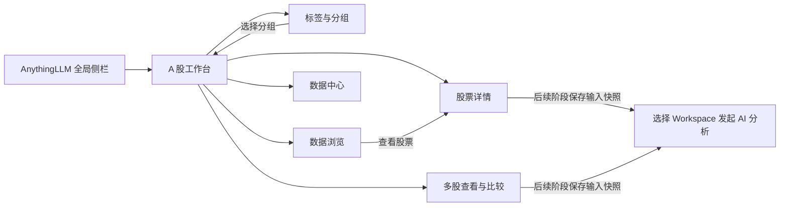
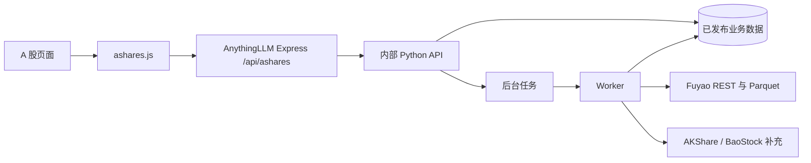

# AnythingLLM A 股前端功能与集成设计

- 状态：讨论稿 v0.1；AnythingLLM 中已实现首期工作台页面与部分接口，其余功能仍按阶段推进。
- 日期：2026-09-29。
- 使用方式：个人独立使用，或多人共享同一套 A 股业务数据。
- 配套方案：[A 股业务域与数据整合方案](ashare-domain-integration-proposal.md)。
- 技术依据：当前 AnythingLLM 的 React、路由、侧栏、登录、请求和后端接入实现。

## 1. 范围与设计结论

在 AnythingLLM 中增加全局 A 股工作台，直接进入可用的股票列表和图表。
主要流程为：选股票、维护标签、保存分组、看日 K、比较多只股票、查看数据和同步状态。
前端查询本地 A 股业务服务；Fuyao 的下载、补数与重试由后台 Worker 执行。

### 1.1 已确认范围

- 盘后分析，以全市场日 K 为主，首期历史默认近 5 年。
- 股票范围为沪深主板、创业板、科创板；北交所、B 股、ETF 不纳入首期。
  检索、查询及手工输入代码均在服务端校验该范围。
- 日/周/月 K、行情表格、自选、手写标签分类、固定/动态分组、多股查看与对比。
- 首期以日线和标签业务为核心；估值、财务、公告、分钟和 AI 按数据能力逐步启用。
- 页面与后续 AI 工具共用数据口径、查询条件、数据版本和质量信息。

### 1.2 个人使用与业务共享规则

| 内容 | 第一版约定 |
| --- | --- |
| 行情与资料 | 使用同一份本地数据 |
| 标签分类、标签、打标 | 全局共用，修改后对全部使用者生效 |
| 自选 | 一个默认自选集合；更多集合由固定分组承担 |
| 分组、备注、比较组合 | 全局共用 |
| 页面偏好 | 列宽、收起状态等可保存在当前浏览器，不作为业务归属 |
| 进入应用 | 沿用 AnythingLLM 现有单用户或登录机制 |
| 日常编辑 | 能进入应用的使用者都可维护共享业务数据 |
| 运维操作 | 数据源检查、全量回填和重建复用已有管理员规则 |

业务接口无需 `user_id`、`owner_id` 或 `workspace_id` 作为数据范围。
业务库不建立用户资产授权表；维护者信息可选，用于变更记录。
单用户模式下，当前使用者可执行运维操作。

Workspace 在后续 AI 分析中用于组织对话、文档和报告。
AnythingLLM 原有会话及文档访问沿用现有机制；删除 Workspace 不删除共享标签或股票分组。

## 2. 如何集成到 AnythingLLM

### 2.1 全局入口与路由

在桌面侧栏的 Workspace 列表上方增加“A 股”入口，移动端抽屉也提供相同入口。
A 股模块拥有独立布局，进入后保留主应用侧栏或其收起按钮。
业务区顶部使用紧凑导航，不要求先创建 Workspace。

| 路由 | 页面 | 导航位置 |
| --- | --- | --- |
| `/ashares` | 股票工作台 | 一级导航，默认入口 |
| `/ashares/stocks/:symbol` | 股票详情 | 从列表、分组或搜索进入 |
| `/ashares/compare` | 多股查看与比较 | 一级导航 |
| `/ashares/collections` | 标签与分组 | 一级导航，内部切换标签/分组 |
| `/ashares/data` | 数据浏览 | 一级导航 |
| `/ashares/data-center` | 数据状态与同步任务 | 一级导航 |

这些路径尚未在当前仓库注册。
股票详情使用标准代码，例如 `600519.SH`；从详情返回时恢复列表筛选、排序和滚动位置。
比较股票、日期范围、周期等可放入 URL，支持刷新和复制当前视图链接。

导航关系：



### 2.2 与当前源码的对应关系

| 接入位置 | 建议修改 |
| --- | --- |
| `frontend/src/main.jsx` | 新增延迟加载的 `/ashares` 父路由及子路由 |
| `frontend/src/utils/paths.js` | 增加 `ashares` 路径生成方法 |
| `frontend/src/components/Sidebar/index.jsx` | 增加桌面和移动端入口及选中状态 |
| `frontend/src/pages/AShares/` | 新增业务布局、工作台和各子页 |
| `frontend/src/components/AShares/` | 新增表格、筛选器、图表及业务弹窗 |
| `frontend/src/models/ashares.js` | 封装 `/api/ashares` 请求 |
| `server/endpoints/ashares.js` | 新增 Express 业务接口及操作校验 |
| `server/utils/ashares/` | 调用内部 Python 服务，转换错误和任务状态 |
| `server/index.js` | 在已有 `/api` 路由器注册 A 股 endpoint |

父路由使用现有 `PrivateRoute`，子页由新增 `ASharesLayout` 的 `<Outlet />` 渲染。
父布局统一承载侧栏、业务导航、能力状态和业务错误边界。
当前 Workspace 聊天页不提供这样的子页容器，A 股模块使用独立父路由。

沿用 `App.jsx` 的主题、i18n、Toast 和登录上下文，复用 Phosphor 图标及现有弹窗风格。
后端沿用 `validatedRequest`；运维接口复用
`flexUserRoleValid([ROLES.admin])`，单用户模式按其既有行为放行。
全局业务接口无需 `validWorkspaceSlug`。

### 2.3 数据调用链



浏览器请求使用 `API_BASE` 和 `baseHeaders()`；JSON 请求补齐相应 `Content-Type`。
Python 服务地址、服务凭据和 `FUYAO_API_KEY` 由部署配置管理。
浏览器只接收业务查询结果、能力状态和任务进度，外部下载链接由 Worker 消费。

建议增加系统级 A 股功能开关，控制导航与路由；该开关尚未实现。
模块不可用时保留主应用导航，并展示可重试的业务错误状态。

## 3. 页面布局与功能总览

### 3.1 页面职责

| 页面 | 核心内容 | 首期交付 |
| --- | --- | --- |
| 股票工作台 | 股票列表、标签筛选、自选、分组、K 线预览、批量操作 | 是 |
| 股票详情 | 日/周/月 K、指标、行情表、资料、标签和备注 | 是 |
| 多股查看与比较 | 2～6 股分屏 K 线、归一化走势、比较表 | 是 |
| 标签与分组 | 分类、标签、打标关系、固定/动态分组和比较组合 | 是 |
| 数据浏览 | 日线明细、筛选、排序、分页和导出 | 日线先交付 |
| 数据中心 | 覆盖、最新日期、缺口、来源状态和同步任务 | 是 |

估值、财务和公告在对应数据集通过验证后加入详情及数据浏览。
分钟、盘口、实时行情和 AI 结果不作为首期可用功能展示。
页面根据服务端能力信息启用功能，未接入数据集显示明确状态，不生成示例数据。

### 3.2 布局与响应式约定

采用工具型布局：紧凑标题、固定工具栏、表格、图表和可收起的辅助区。
页面区域直接排布；重复图表才使用明确的图表容器。
新增面板、弹窗和按钮遵循现有主题，业务容器圆角控制在 8px 以内。

工作台按业务区实际可用宽度调整，避免展开主侧栏后挤压图表：

| 可用业务区宽度 | 工作台布局 |
| --- | --- |
| 至少 1120px | 三栏：集合导航约 192px、股票列表约 360px、图表占剩余空间 |
| 800～1119px | 两栏：集合改为菜单，列表至少 320px、图表至少 420px |
| 小于 800px | 单栏：列表/K 线切换；筛选和集合使用抽屉 |

主应用侧栏沿用现有收起机制；业务区使用 `min-width: 0` 和各自滚动区域。
工具栏允许按控件分组换行，批量操作栏预留高度，避免遮住最后一行。
图表设置稳定高度，移动端单图建议至少 280px；多图按断点明确网格列数。
表格允许区域内水平滚动，页面整体不横向溢出。

按钮中的常见工具使用已有图标，并提供 tooltip 和可访问名称。
周期、复权及查看模式使用分段选择；标签颜色使用色块；集合与排序使用菜单。
涨跌默认红涨绿跌、平盘中性，同时显示数值和符号；缺数不能仅用颜色表达。

## 4. 股票工作台

### 4.1 区域组成

| 区域 | 内容与操作 |
| --- | --- |
| 顶部状态 | 目标/最新交易日、覆盖状态、正在运行的任务入口 |
| 集合导航 | 全市场、自选、固定分组、动态分组；显示成员数 |
| 筛选栏 | 代码/名称搜索、板块、包含标签、排除标签、全部/任一匹配 |
| 股票列表 | 行情摘要、标签、备注标识、自选星标和多选框 |
| K 线预览 | 当前股票日/周/月 K、成交量、日期和复权选择 |
| 批量操作栏 | 打标、移除标签、加自选、加固定分组、多股比较、导出 |

默认进入全市场列表，选中股票后在同页预览 K 线，双击或明确的详情命令进入详情页。
集合导航采用列表；不把每个分组展示为大型卡片。

### 4.2 股票列表

默认列：自选、代码、名称、板块、目标日收盘价、涨跌幅、成交额、标签、行情日期。
涨跌幅只在有可靠基准时显示；换手率、估值等列按实际数据能力加入列菜单。
同一列表固定行情目标日，缺该日数据时显示缺数；较早的有效收盘另带实际日期展示，
不拿不同交易日的成交额或涨跌幅参与同一次目标日排序。
来源状态、停牌或缺数以单独状态展示，零成交量与缺失值区别显示。
行情摘要由服务端批量查询返回，不为每一行发起独立历史请求。

- 搜索支持完整代码、纯代码、名称和已维护的别名；保留代码前导零。
- 按列排序由服务端完成，缺失值排在有效值后，使用稳定的次排序键。
- 默认每页 50 行，可调整为 100 行；连续分页固定查询数据视图。
- 单选只改变预览股票；多选集合独立维护，最多 6 股进入比较。
- 自选星标即时提交，失败时恢复原状态并保留明确错误。
- 标签过多时显示前几个与剩余数量，展开查看完整标签及分类。
- 点击状态进入该股票的数据覆盖信息，补数动作提交后台任务。

### 4.3 标签筛选与批量操作

筛选包含“全部满足”“任一满足”和排除标签，板块与集合范围同时生效。
标签条件统一传给列表、分组预览和导出；没有选标签时不加标签限制。
标签、分类和分组编辑成功后，刷新相应成员数、列表及筛选缓存。

多选默认选择当前页，跨页选择保留明确的股票 ID；切换集合或筛选时清空旧选择。
面向整个筛选结果的操作，由服务端在提交时固定成员并返回实际影响数量。
较大的打标或导出可转为任务，前端不先下载全市场历史数据来计算成员。

批量打标支持同时添加或移除多个标签；重复添加保持幂等。
保存分组提供两种命令：保存当前结果为固定分组，或保存筛选条件为动态分组。

### 4.4 状态与返回行为

URL 保存集合、搜索、板块、标签条件和排序；参数通过 `URLSearchParams` 解析与生成。
分页与滚动位置在返回工作台时恢复，当前选股及比较篮保留在业务布局状态中。
搜索输入进行短暂防抖；快速切换股票时取消旧请求，迟到结果不能覆盖当前股票。
首次尚无本地日线时显示同步状态和初始化入口；初始化仍在后台运行时可查看已发布部分。

## 5. 股票详情

### 5.1 页面结构

顶部展示名称、代码、板块、自选星标、标签入口及实际行情日期。
主区域首期提供“图表”“行情表”“资料”三个 tab，右侧或抽屉维护标签与备注。
估值、财务、公告 tab 随数据能力启用，显示原始时间和口径。

图表工具栏提供：

- 周期：日、周、月。
- 复权：未复权、前复权、后复权，按能力启用。
- 日期：近 3 月、近 1 年、近 3 年、全部已接入历史及自定义范围。
- 指标：MA、成交量均线、MACD；参数采用数值输入。
- 操作：复位视图、导出当前数据、加入比较。

第一版默认近 1 年日 K，优先未复权；来源复权或本地算法通过验证后可记住用户选择。
日期快捷项和指标名称是控件值，不用长段说明占据图表区域。

### 5.2 K 线行为

图表和指标读取服务端结果，复权、周/月聚合和预热数据计算由统一查询层完成。
成交量和成交额保持原始单位，价格和对比采用统一复权口径。
十字光标展示交易日、OHLC、量额及指标值，缩放或悬浮不会改变工具栏尺寸。

停牌、未上市和采集缺失分别表示；OHLC 与成交量不能通过填充生成交易记录。
周/月未结束周期显示相应状态，盘后价格使用最近已发布收盘价。
图表库建议阶段 0 验证 Lightweight Charts；所需副图与授权标识一并核对。

### 5.3 行情表与资料

行情表列出交易日、OHLC、成交量、成交额和质量状态，沿用当前日期与复权选择。
复权表格明确显示所选口径，导出附单位、算法/来源和数据版本。
资料展示交易所、板块、上市信息、行业等已接入字段；缺失字段使用空值状态。

标签编辑复用工作台弹窗；股票备注统一保存一份，列表、详情、自选与分组共用。
备注按单股编辑并显示更新时间。
离开有未提交修改的表单时提示处理，保存失败保留输入。
后续 AI 分析按钮在工具链实际接入后启用，提交前固定当前股票与数据条件。

## 6. 多股查看与比较

### 6.1 共用操作

顶部显示选中的 2～6 只股票，支持检索添加、移除和调整顺序。
统一控制日期范围、周期和复权；模式切换为“分屏 K 线”“走势对比”。
保存比较组合时记录股票顺序、日期条件、周期、复权和指标参数。
再次打开组合按保存条件查询当前已发布数据，历史分析输入另外保存快照。

批量接口固定同一个数据视图，返回每只股票的数据、覆盖和质量状态。
加入超过上限的股票时提示数量限制；条件变更一次提交批量请求，避免逐图请求。

### 6.2 分屏 K 线

- 2 股默认两列；3～6 股按可用宽度使用两列或三列，窄屏改为单列。
- 图表容器高度稳定，每张显示名称、代码、实际日期和独立的质量状态。
- 日期窗口联动，十字光标按交易日对应；价格轴默认各自独立。
- 指标配置默认共用，单图放大使用业务区展开视图，返回后恢复网格。
- 单股缺数时对应图表显示原因和补数入口，其余图表仍可查看。

### 6.3 走势对比

按所有参与股票共同有效的起始交易日归一为 100，服务端计算相对价格变化。
同一比较使用一致复权口径；无共同基准时显示未满足条件的股票和日期范围。
用户可移除股票或调整范围后重新查询，不自动给缺数股票填入价格。

图例支持隐藏/显示股票，但不改变已固定的比较基准；改变参与集合需重新计算。
下方比较表展示区间价格变化、最新有效日期、成交额摘要和覆盖情况。
前复权价格变化不作为包含现金分红再投资的总回报指标。
停牌和缺口在曲线中保留可识别状态，不能把数据缺失画成零收益。

## 7. 标签、分组与比较组合管理

页面内部用 tab 区分“标签分类”“股票分组”“比较组合”。
左侧为目录或列表，右侧为当前条目的配置和股票成员；不增加个人/共享范围选择器。

### 7.1 标签分类与标签

| 操作 | 行为 |
| --- | --- |
| 新建分类 | 输入名称和可选说明，调整显示顺序 |
| 新建标签 | 选择分类，输入名称、说明和颜色；保存后即可筛选 |
| 编辑标签 | 名称、分类、颜色、说明可改，稳定 ID 保持不变 |
| 查看关联股票 | 复用工作台筛选查询，支持打开详情和批量操作 |
| 合并标签 | 选定保留标签，预览股票去重数量及分组条件冲突 |
| 删除标签 | 预览关联股票数与引用分组，处理引用后删除 |
| 删除分类 | 先移动所属标签或清空分类，再删除空目录 |

采用一级分类，默认提供“未分类”容器；业务标签名称由使用者自由创建。
默认容器保留，使用者创建的分类可在移走所属标签后删除。
分类名称和标签名称各自全局去重；提交时去除首尾空白并校验长度。
标签列表显示颜色、说明、关联股数和更新时间，不用颜色表达分类结构。

标签合并在服务端事务中更新关系与动态条件，发生包含/排除冲突时要求调整。
仍被动态分组引用的标签不能直接删除，弹窗链接到相关分组条件编辑。
删除后，仍引用该标签的视图标记条件失效并停止新查询和导出。
使用者明确修正条件后重新查询，不能自动放宽为全市场查询。
编辑冲突保留当前输入，并提示刷新后重试。

### 7.2 固定分组

固定分组保存明确的成员和顺序，入口包括手工新建、批量加入和复制筛选结果。
成员支持搜索添加、批量移除、拖拽排序，股票移出分组不会删除行情或标签。
详情显示成员数、备注、更新时间和数据覆盖，可直接进入工作台或多股比较。

复制筛选结果时由服务端固定提交时的成员，返回实际成员数。
之后标签或行情变化不会自动改变固定成员。
名称和说明为共享内容，提交前显示成员变更数量。

### 7.3 动态分组

动态分组保存集合范围、板块、包含标签、匹配方式和排除标签。
使用工作台同一套筛选组件，编辑时预览成员数与股票列表。
第一版范围限定为全市场或默认自选，不允许动态分组递归引用其他动态分组。

动态成员在查看时计算，手工修改成员应通过修改标签、条件或自选关系完成。
条件摘要用分类与标签名称展示，存储使用稳定 ID 与定义版本。
支持复制当前成员为固定分组，再进行人工增减。
标签条件失效时显示明确错误，保留条件供修复，并禁止无条件查询或导出。

### 7.4 共享编辑刷新

当前页面编辑成功后，失效相关查询缓存并重新读取服务端结果。
其他页面在窗口重新获得焦点、显式刷新或短周期状态检查时更新成员与版本。
第一版无需实时协作服务，使用实体版本号处理并发修改。
服务端返回版本冲突时不覆盖本地表单，用户可核对最新内容后重新提交。

## 8. 数据浏览

顶部选择已接入数据集、股票集合、标签条件和日期或报告期，主体为可排序数据表。
沿用工作台股票标识、标签筛选、服务端分页和导出逻辑。

| 数据集 | 主要列与筛选 | 启用阶段 |
| --- | --- | --- |
| 日线 | 股票、交易日、OHLC、成交量、成交额、来源、质量 | 首期 |
| 估值快照 | 股票、PE/PB/PS/PCF、TTM/MRQ、采集及上游时间 | 第二阶段 |
| 历史估值 | 股票、已确认交易日、指标口径、来源 | 有历史来源时启用 |
| 财务三表 | 股票、报告期、披露日、指标、币种、修订信息 | 第二阶段 |
| 公告元数据 | 股票、标题、发布时间、分类、原文链接、内容状态 | 第二阶段 |

Fuyao 估值只有最新快照，从采集日起积累；历史估值页按实际回填来源显示。
财务接口的 `data.timestamp` 是报告期末最大值，页面分别显示报告期与披露日期。
未获知真实交易日的估值只列入采集快照，不能按采集日伪装为历史交易日数据。
财务空值与估值负数原样保留，表格中不补零。

支持调整列、查看来源/单位信息、跳转股票详情、导出筛选结果。
大范围导出提交任务，固定成员和数据视图，完成后提供到期下载入口。
浏览器处理当前查询结果；全市场 Parquet 解析、指标和量额换算在后台完成。

## 9. 数据中心

### 9.1 总览与数据覆盖

总览使用紧凑状态条和表格，显示目标交易日、实际最新日期、覆盖率、缺口与失败任务。
点击缺口进入证券列表，可按板块、日期、缺失原因、来源和可回补能力筛选。
缺数、停牌、未上市和来源未就绪分别表示；部分发布不显示为全市场齐全。
交易日历不足时显示相应限制，不能按自然日把节假日计入行情缺口。

| 区域 | 功能 |
| --- | --- |
| 数据集状态 | 最新日期、历史范围、有效记录、质量、更新时间 |
| 覆盖明细 | 目标板块/股票数量、缺口、未映射证券和隔离记录 |
| 来源状态 | 已配置、鉴权/权限错误、最近成功时间、限流状态 |
| 任务列表 | 类型、范围、进度、成功/失败数、开始时间与错误摘要 |
| 任务详情 | 分项结果、重试信息、当前阶段、文件校验结果 |

来源日期、采集时间和本地发布时间各自命名，按上海时间展示。
页面展示批量文件的实际范围和本地校验状态，不依赖下载链接存在就判断数据就绪。

### 9.2 同步操作

- 首次初始化：获取 Fuyao 全量日线、公司行动与主数据，按配置导入近 5 年。
- 立即同步：重放最近 10 个交易日日线，刷新公司行动与覆盖状态。
- 定向补数：提交选中股票、数据集与日期范围，后台选择适合的恢复路径。
- 重试失败项：基于已完成任务生成补数任务，保留原始失败记录。
- 取消与重试：首期提供；暂停与继续在 Worker 支持后启用，已发布数据继续有效。
- 定期全量校正：由调度执行，页面可查看结果；管理员可手动触发。

首次初始化不在浏览器请求中等待完成；提交后立即返回任务 ID，页面展示分阶段进度。
任务状态与覆盖状态分开，`partial` 表示已完成部分分项，列表仍列出失败和待补范围。
近期文件无法修复超过 10 个交易日的缺口时，后台使用单股接口或全量文件恢复。

Fuyao API Key 第一版由部署环境配置注入；页面显示配置状态及连接检查结果。
密钥不回显，错误信息去除凭据和预签名链接查询参数。
普通使用者可查看数据状态和提交限额补数，运维动作复用现有管理员校验。

### 9.3 任务交互

正在运行的任务在页面可见时每 5 秒查询一次，终态停止轮询，离开页面清理请求。
返回页面时重新获取任务状态，任务执行与页面生命周期独立。
错误分为配置/权限、限流、未就绪、网络、字段变化和质量问题，返回可操作原因。
可恢复任务显示下一次重试状态；需要修正配置的任务显示明确失败。
进度同时给出当前阶段和已处理/目标数量，不伪造尚无总量信息的百分比。

## 10. 前端模块、状态与接口

### 10.1 建议目录

以下目录为拟新增内容，实施时遵循项目现有命名和格式约定。

```text
frontend/src/
  pages/AShares/
    index.jsx                    # 模块入口与路由导出
    Layout.jsx                   # 侧栏、业务导航和子页容器
    Workbench/index.jsx          # 工作台
    StockDetail/index.jsx        # 详情
    Compare/index.jsx            # 分屏与走势比较
    Collections/index.jsx        # 标签、分组和比较组合
    DataBrowser/index.jsx        # 数据浏览
    DataCenter/index.jsx         # 数据覆盖与任务
  components/AShares/
    StockTable/                  # 列表、选择及行状态
    StockFilter/                 # 各页面共用结构化筛选
    TagEditor/                   # 分类、标签及批量打标
    GroupEditor/                 # 固定成员与动态条件
    ChartToolbar/                # 日期、周期、复权与指标
    KlineChart/                  # 图表库封装及资源释放
    CompareGrid/                 # 多图联动
    DataStatus/                  # 时效、覆盖和质量
    JobProgress/                 # 任务阶段和分项状态
  hooks/ashares/                 # 查询、取消和任务状态 hook
  models/ashares.js              # HTTP 客户端及业务错误解析
```

图表库只在图表路由/组件中加载；Recharts 可用于普通统计和对比曲线。
各页面复用筛选、标签编辑和状态组件，避免同一标签逻辑出现多个实现。
图表实例在卸载时清理事件、观察器和 canvas，模式切换不能残留重复监听。

### 10.2 状态分工

| 状态 | 保存位置 | 生命周期 |
| --- | --- | --- |
| 集合、筛选、排序、周期和日期 | URL 参数 | 刷新、返回和分享视图时恢复 |
| 当前选股、比较篮 | A 股父布局中的业务状态 | 业务子页切换时保留 |
| 列宽、面板收起、显示偏好 | 当前浏览器存储 | 不承担标签或分组持久化 |
| 表单未提交内容 | 编辑组件本地状态 | 关闭前处理未保存内容 |
| 标签、分组、行情与任务 | 服务端；前端保留查询缓存 | 根据版本和操作结果刷新 |

第一版使用已有 React hook 与请求模式，复杂度增加后再评估额外状态库。
查询缓存与编辑状态分别维护，任务轮询不应让全部图表重新初始化。
标签/分组变更失效成员查询，日线/复权版本变更失效相应图表与比较结果。
版本信息用于判断缓存与一致性；历史复现使用输入快照，不假设任意旧版本全库可重查。

### 10.3 页面与业务接口对应

统一浏览器前缀为 `/api/ashares`；下面均为拟新增接口。

| 页面或操作 | 接口 | 关键要求 |
| --- | --- | --- |
| 启动与功能启用 | `GET /capabilities` | 周期、复权、数据集和额度 |
| 名称/代码搜索 | `GET /securities` | 只返回目标市场的标准标识 |
| 工作台列表 | `POST /securities/query` | 行情目标日、标签、排序、分页 |
| 详情与单图 | `GET /securities/:symbol/bars` | 单位、日期、复权、质量 |
| 多图 | `POST /bars/batch` | 固定视图，逐股状态 |
| 走势比较 | `POST /comparisons/query` | 服务端基准和计算结果 |
| 标签分类/标签 | `/tag-categories`、`/tags` 的 CRUD | 全局名称、稳定 ID、版本冲突 |
| 批量打标 | `POST /security-tags/batch` | 明确成员或结构化筛选、幂等 |
| 自选/备注 | `/watchlists`、`/securities/:symbol/notes` | 全局业务数据 |
| 分组/比较组合 | `/groups`、`/comparison-sets` 的 CRUD | 固定成员或版本化条件 |
| 数据浏览 | `POST /datasets/:dataset/rows/query` | 数据集、字段白名单和分页 |
| 数据覆盖 | `GET /data-status` | 总览及证券/日期范围筛选 |
| 来源状态/检查 | `GET /providers`、`POST /providers/:provider/check` | 配置状态与运维校验 |
| 同步任务 | `POST /sync-jobs`、`GET /sync-jobs/:id` | 异步进度、失败分项、幂等 |
| 任务控制 | `POST /sync-jobs/:id/actions` | 仅接受已经支持的控制动作 |
| 导出 | `POST /exports`、`GET /exports/:id` | 固定实际数据视图、到期下载 |

CRUD 表示相应 `GET/POST/PATCH/DELETE`，具体子路径在接口实现前确定。
详情资料、估值、财务和公告读取配套方案中相应证券子接口。
普通业务请求统一使用共享数据范围，运维角色在 Express 服务端校验。

工作台查询结构示例，ID 均为说明用途，实际由服务端分配：

```json
{
  "filter": {
    "scope": "all_market",
    "include_tag_ids": [101, 102],
    "tag_match": "all",
    "exclude_tag_ids": [],
    "exchanges": ["SH", "SZ"],
    "boards": ["SSE_MAIN", "SZSE_MAIN", "CHINEXT", "STAR"],
    "filter_version": 1
  },
  "as_of": "latest_published",
  "sort": {
    "field": "change_pct",
    "direction": "desc"
  },
  "page": {
    "size": 50,
    "cursor": null
  }
}
```

`latest_published` 在服务端解析成明确的行情目标日，响应携带该日期与数据版本。
分页游标绑定条件和版本；发布变化导致视图失效时要求重新查询，不能混拼版本。
股票总数、过滤成员数、无行情数量和分页条数分别返回。
批量操作在服务端冻结实际成员，任务结果与导出清单记录该成员集合。

### 10.4 错误、空值与加载状态

| 状态 | 前端行为 |
| --- | --- |
| 首次加载 | 固定尺寸骨架，保留导航和工具栏 |
| 查询更新 | 保留原结果并标记更新中；新条件与旧数据不能混淆 |
| 无匹配股票 | 空列表，保留当前筛选及重置命令 |
| 无行情/未接入 | 显示实际覆盖和原因，保留股票资料与标签 |
| 服务不可用 | 局部错误与重试，主应用导航继续可用 |
| 来源未就绪 | 展示本地有效日期和补数任务状态 |
| 批量部分失败 | 各股独立错误，成功结果仍可查看 |
| 编辑版本冲突 | 保留输入，展示刷新与重新提交入口 |
| 导出过期 | 显示到期状态，可重新提交原查询 |

请求层区分网络、HTTP 和业务错误，不把失败转换成空数组或成功提示。
客户端取消请求不弹错误 Toast；页面保留明确的请求 ID，便于核对服务端日志。
缓存结果携带真实日期和质量信息，旧结果不能标为今日完整数据。

### 10.5 交互与性能要求

- 首次只加载当前页列表及当前股票，按需读取历史和低频信息。
- 能力、标签目录、分组目录等独立请求可并行，避免串行等待。
- 快速切换条件使用 `AbortController` 或等效请求标识处理迟到结果。
- 多图复用批量响应，日期联动采用图表 API，不为光标移动重复请求。
- 移动端隐藏的图表不持续渲染；任务状态轮询在不可见或终态时停止。
- 使用主题色、稳定行高、清晰焦点和可访问标签；表格与按钮文字不溢出。

性能验证沿用配套方案目标：在约定机器和数据量下，缓存命中的单股 2 年日 K、
6 股比较交互以 2 秒内完成为目标，记录 p95 与响应体积；该目标尚未实测。

## 11. 后续 AI 入口

在股票详情、多股比较及分组操作中增加“分析”命令，工具链可用后显示。
分析流程如下：

1. 从当前视图提取股票、标签/分组条件、日期、周期、复权与指标参数。
2. 服务端固定动态分组的实际成员及实际数据，检查是否与页面版本一致。
3. 保存分析输入快照，返回快照 ID、实际范围、质量和缺失提示。
4. 选择可访问的 AnythingLLM Workspace，创建或进入相应对话。
5. 通过受限只读工具读取快照/本地数据，将报告与输入快照关联。

股票业务数据全局共享，目标 Workspace 的会话访问按主应用现有规则处理。
自写标签和备注作为使用者观点传入，财务事实与行情计算来自结构化数据。
结构化数据查询使用本地服务，财报和公告正文继续使用 AnythingLLM 文档/RAG 能力。

Fuyao 托管 MCP 可提供外部查询补充，但页面与分组分析先读取本地已发布数据。
使用外部数据时保留来源、时间和实际结果，避免与页面输入版本混用。
第一版前端先保存统一视图条件，真实快照和 Agent 调用在 AI 阶段交付。

## 12. 实施顺序与验收

### 12.1 建议拆分

| 顺序 | 交付内容 | 依赖 |
| --- | --- | --- |
| 1 | 全局入口、父布局、能力状态、登录接入、数据中心最小状态页 | Express 接入和服务健康接口 |
| 2 | 股票检索、工作台分页与共享自选 | 主数据及目标日行情摘要 |
| 3 | 标签分类、批量打标、固定/动态分组和备注 | 共享业务模型和版本冲突契约 |
| 4 | 股票详情、日/周/月 K、行情表、指标与日期控制 | 已验证日线和复权查询 |
| 5 | 多股分屏、走势比较、数据浏览、导出和补数任务 | 批量查询及后台任务 |
| 6 | 估值、财务、公告及 AI 入口 | 对应数据集和真实工具链通过验收 |

这些任务尚未实施，具体工期随数据源和图表验证结果确定。
前端可用阶段 0 的真实小样本推进，生产视图不提供伪造行情或占位报告。

### 12.2 验收清单

1. 全局入口在桌面和移动端可达，刷新子路由正确，原有聊天及设置流程可使用。
2. 单用户模式可完整使用；多人模式共享标签、分组、备注和比较组合。
   业务查询结果不随登录者或 Workspace 改变，运维操作符合既有角色规则。
3. 工作台、动态分组、数据浏览与导出使用相同筛选逻辑，固定分组保留固定成员。
4. 标签重命名、移动分类、合并和删除正确处理引用，版本冲突不会静默覆盖。
5. 日/周/月聚合、复权、量额单位、停牌和缺口状态与统一服务契约一致。
6. 6 股比较采用同一窗口和数据视图，缺数仅影响相应股票，切换条件无迟到结果覆盖。
7. 盘后同步尚未完成时显示真实目标日和覆盖；HTTP 200 业务错误不显示为数据就绪。
8. 前后导航能恢复查询状态；桌面、窄屏和移动端无控件遮挡、文字溢出及空白图表。
9. 批量操作与导出固定实际成员，后台任务不依赖页面持续打开，取消后已发布数据有效。
10. Fuyao API Key 和对象存储签名参数不出现在浏览器响应、导出内容及页面日志中。
11. 按约定机器记录列表、单图和多图性能；图表卸载后没有重复实例和持续监听。
12. AI 阶段核对页面输入与实际快照一致，报告能追溯数据时间、来源、质量和原始引用。

## 13. 依据、验证与产物盘点

### 13.1 已核对的本地入口

- [前端路由](../anything-llm/frontend/src/main.jsx)
- [主题、登录与页面容器](../anything-llm/frontend/src/App.jsx)
- [主页面布局](../anything-llm/frontend/src/pages/Main/index.jsx)
- [桌面和移动端侧栏](../anything-llm/frontend/src/components/Sidebar/index.jsx)
- [页面登录与角色路由](../anything-llm/frontend/src/components/PrivateRoute/index.jsx)
- [路径生成约定](../anything-llm/frontend/src/utils/paths.js)
- [请求头工具](../anything-llm/frontend/src/utils/request.js)
- [现有业务模型请求](../anything-llm/frontend/src/models/workspace.js)
- [前端依赖](../anything-llm/frontend/package.json)
- [Express 注册入口](../anything-llm/server/index.js)
- [后端登录校验](../anything-llm/server/utils/middleware/validatedRequest.js)
- [单用户兼容的角色校验](../anything-llm/server/utils/middleware/multiUserProtected.js)
- [业务 endpoint 注册模式](../anything-llm/server/endpoints/workspaces.js)

Fuyao 获取路径和契约依据见配套数据方案第 2.5、5.6、6.5 和 13.3 节。

### 13.2 本轮验证范围

- 静态检查：核对源码入口、页面/接口对应、共享规则、Markdown、JSON 示例和本地引用。
- 实际构建：未执行，本轮交付为设计文档。
- 测试：未实现页面，未运行图表、业务或真实数据采集测试。
- 部署验证：未执行，没有启动开发服务或部署新功能。

### 13.3 产物盘点

| 位置 | 用途 | 当前状态 | 处理建议 |
| --- | --- | --- | --- |
| `docs/ashare-frontend-design.md` | 正式前端功能设计 | 已完成讨论稿 | 保留并随评审更新 |
| `docs/ashare-domain-integration-proposal.md` | 配套数据方案，已按共享模型同步 | 已更新讨论稿 | 保留 |
| `tmp/fuyao-source-research-20260929/` | 两份公开接口文档快照 | 合计约 429 KiB，已保留 | 待人工确认 |

本轮前端调研未生成新的运行日志、下载文件、测试数据或临时脚本。
既有两份 Fuyao 快照的逐文件大小、摘要和处理建议由配套方案第 13.4 节持续记录。
